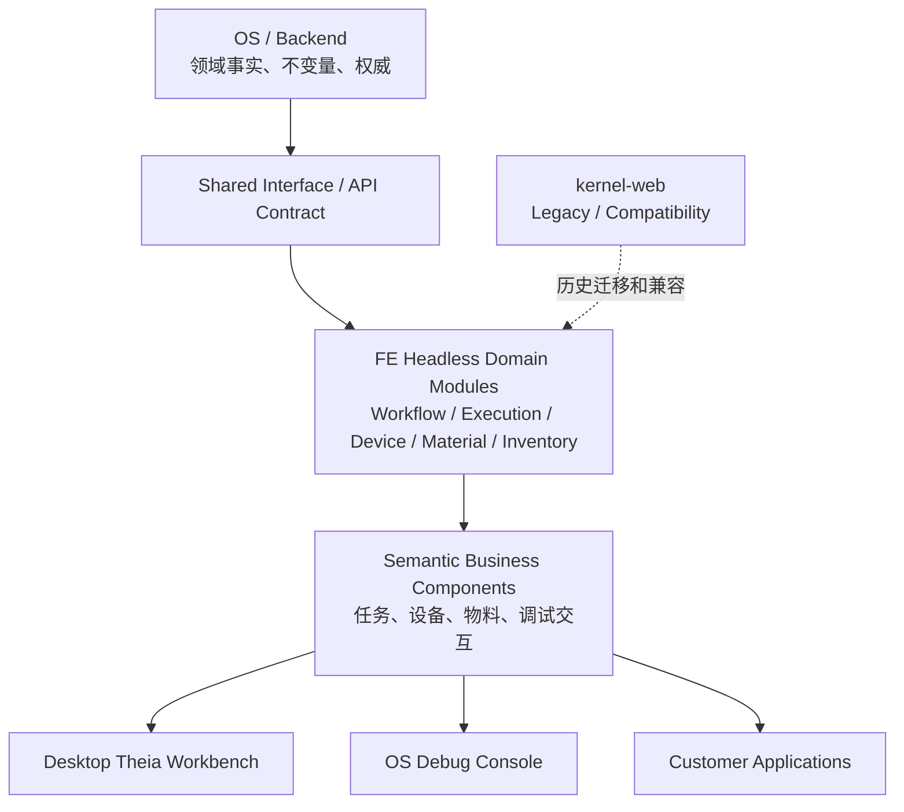

# Uni-Lab FE 领域模型与产品架构主线

> 状态：讨论中的主线文档
>
> 更新时间：2026-09-22
>
> 本文记录 `uni-lab-fe` 后续架构和产品讨论的共同上下文。它不是当前实现的完整描述，也不替代已经生效的仓库约束；已经确定的长期决策，后续应进一步沉淀为独立 ADR。

## 1. 文档目标

当前讨论已经从“如何整理 packages”收敛为三个相互关联的问题：

1. 以 `uni-lab-os` 已确认的业务语义为基准，重建 FE 的领域模型；
2. 区分核心领域能力、应用适配器、桌面宿主、可选扩展和历史兼容层；
3. 在没有专职产品同学的情况下，共同设计 Workflow Debugging 等核心业务流程。

本文用于：

- 保存已经确认的上下文和架构判断；
- 追踪 OS → FE 的领域模型映射；
- 记录 packages 的分类、处置方向和依赖问题；
- 记录产品角色、用户任务和交互决策；
- 集中管理待验证问题和后续纵向切片。

内容使用以下状态标记：

- `[已确认]`：来自代码、OS 文档、分支信息或同事明确说明；
- `[当前判断]`：基于现有信息形成的架构判断；
- `[已决策]`：后续实现应遵守的方向；
- `[待验证]`：需要继续读代码、运行系统或与同事确认；
- `[历史问题]`：当前存在，但不作为未来架构依据。

## 2. 当前项目和分支定位

### 2.1 `uni-lab-os`

`product/durable-scheduler-kernel-v2` 是当前开发中的简易版本，主要面向内部人员调试和验证。

`[已确认]` 它的主要价值是验证：

- WorkflowTask、Job 和 Scheduler 的运行闭环；
- Device、Action、Resource、Material、Site 和 Inventory 的业务语义；
- Reservation、Ledger、Evidence、Intervention 等执行后事实；
- Backend、Edge、Authority 的权威边界；
- 等待、失败、取消、恢复和 `execution_unknown` 等状态。

`[当前判断]` OS v2 前端是领域运行流程和内部操作方式的参考实现，但不必作为最终产品视觉和交互的标准实现。

### 2.2 `uni-lab-fe`

`feature/theia-workflow-source-save` 是当前开发中的桌面端最新版本，后续前端产品形态应优先研究这条线。

`[当前判断]` 桌面端应成为新的产品工作台方向，但领域能力不应被 Theia 或桌面宿主拥有，而应由可复用的 headless 模块提供。

### 2.3 `kernel-web`

`kernel-web` 是第一版前端内核，正在逐步退出历史舞台。

`[已确认]` 它仍然有两类价值：

- 了解第一代前端如何组织服务、页面、工作台和插件；
- 识别需要迁移、冻结、兼容或删除的历史抽象。

`[已决策]` `kernel-web` 不作为新领域模型和新产品交互的主要依据，也不继续作为所有新能力的默认承载入口。

## 3. 总体架构假设

后续目标结构暂定为：



核心原则：

1. OS/Backend 定义业务事实、状态、不变量和所有权；
2. FE 不直接镜像后端类，而是建立面向用户任务的领域投影；
3. Services 是接口、查询、命令和适配器的承载处，不应继续成为无边界的粘合层；
4. Theia 是桌面宿主和源码编辑基础设施，不是 Workflow 领域模型的拥有者；
5. Device Plugin 是可选扩展能力，不应反向决定核心 Device 模型；
6. 应用只组合领域模块，不在页面中重新实现业务规则。

### 3.1 不按“运营 / 开发”硬切领域

`[已决策]` “实验室运营”“Workflow 开发”“设备调试”是产品视角和用户任务，不是互斥的领域边界。

它们会共同使用 Device、Material/Site、Inventory、Workflow Definition 和 Execution 的事实。例如，Workflow 调试同样需要发现设备能力、绑定物料、执行 preflight、创建调试任务、观察资源占用并处理失败。因此不能为“开发端”再复制一套资源模型。

后续使用三个正交维度理解前端：

```text
领域事实所有权：Device / Material-Site / Reagent Catalog / Inventory /
                 Workflow Definition / Execution / Runtime

生命周期：       Define → Prepare/Bind → Execute → Observe →
                 Intervene/Recover → Audit/Reconcile

产品工作台：     OS Console / Desktop Workbench / Device Debug /
                 Customer Application
```

页面是这三个维度的组合投影，而不是新的事实来源。判断模块边界时优先问“谁拥有事实和不变量”，不要问“它出现在哪个页面”。

### 3.2 领域模块与场景能力

后续建议把领域能力和跨领域场景能力分开：

| 层次 | 典型模块 | 责任 |
| --- | --- | --- |
| 领域能力 | Device、Material/Site、Reagent Catalog、Inventory、Workflow Definition、Execution | 提供事实、查询、命令、状态和权威边界 |
| 场景能力 | Resource Binding、Preflight、Run Workflow、Task Recovery、Manual Movement、Lab Scene | 编排多个领域完成一个用户任务 |
| 标准 UI | Picker、Table、DAG、Task Monitor、Preflight Panel、2D/3D Scene | 将能力呈现为可复用的交互组件 |
| 产品宿主 | OS Console、Desktop Workbench、Device Debug、Customer App | 负责导航、权限呈现和产品级流程组合 |

`kernel-web` 的历史问题不是“存在跨领域粘合逻辑”，而是大量基础设施、服务、页面状态和业务编排都被放进了一个缺少明确用例名称的 Kernel。未来需要拆出有边界的场景能力，而不是消除跨领域编排本身。

### 3.3 Workflow 的两个生命周期

```text
Workflow Definition：Source → Compile → Validate → Revision → Publish

Workflow Execution：  Bind → Preflight → WorkflowTask → Plan → Job
                     → Execute → Recover / Audit
```

Workflow Definition 拥有“需要什么资源”的声明；Resource Binding 和 Preflight 将抽象需求绑定到真实设备、物料、批次、库位和 Edge；Execution 冻结本次运行并维护 Task/Job 生命周期。调试能力正是连接这两个生命周期的场景能力。

## 4. OS → FE 领域模型桥接

### 4.1 领域执行主线

```text
Device / ActionDefinition / ActionContract
          ↓
Workflow / Revision / Publication
          ↓
WorkflowTask
          ↓
ExecutionPlan
          ↓
WorkflowNodeJob
          ↓
Scheduler / Dispatch
          ↓
Device execution + Material / Inventory changes
          ↓
Outcome / Evidence / Ledger / Intervention
```

Workflow 是可复用的实验流程定义；WorkflowTask 是一次具体实验运行；WorkflowNode 是定义中的步骤；Job 是该步骤在一次 Task 中的实际执行。

### 4.2 核心概念映射表

| OS/Backend 概念 | FE 当前相关类型或 package | 后续需要确认的方向 |
| --- | --- | --- |
| Device / Device instance | `OnlineDevice`、`ManagedDevice`、`device-management` | 区分设备事实、运行状态、展示投影和设备选择器 |
| ActionDefinition / ActionContract | `DeviceAction`、`services/laboratory.ts`、`device-card-sdk` | 区分动作定义/核心动作合同与可选设备 UI 扩展 |
| Material / MaterialAggregate | `packages/material` | 以 MaterialAggregate 作为前端物料图投影，并对齐 OS Material 语义 |
| Site / SiteOccupancy | `MaterialSite`、`MaterialPlacement` | 明确 Site、Placement、Occupancy 和资源拓扑的区别 |
| Reagent / Lot / Inventory | `ReagentInfoItem`、`ReagentInventoryItem`、`services/inventory.ts` | 区分试剂信息、数量库存、批次、预留和结算事实 |
| Reservation / Ledger | 库存和任务相关 service 合同 | 对齐预留、实际消耗、释放和审计台账 |
| Workflow / Revision / Publication | `workflow-editor`、`services/workflow.ts` | 分离工作流定义、编辑草稿、发布合同和运行快照 |
| WorkflowTask / Job | `workflowTaskContracts.ts`、`deviceActionTasks` | 对齐 Workflow 与 `ad_hoc_device_action` 的执行模型 |
| Authority / Backend / Edge | `backends.ts`、`capabilities.ts`、Profile | 将权威边界体现在查询、命令和错误模型中 |
| Evidence / Realtime | `realtime`、任务反馈和状态投影 | 区分事件、状态重新读取、反馈游标和执行证据 |

### 4.3 FE 类型的五种分类

FE 类型不能只按“是否来自 API”分类，应标记其语义角色：

```text
Server Fact       服务端权威事实
Command           用户意图或领域命令
Draft             编辑中的工作流、参数或表单草稿
Projection        面向页面的展示投影
Session/UI State  布局、选中、高亮、面板和临时交互状态
```

例如：

- `WorkflowTask` 状态是 Server Fact；
- “暂停任务”是 Command；
- 正在编辑的 Workflow Revision 是 Draft；
- 设备卡片中的在线状态摘要是 Projection；
- 当前选中的 node、panel layout 是 Session/UI State。

## 5. packages 分类和处置方向

packages 不等于领域模块，当前先按职责分为五类。

### 5.1 核心领域能力

需要优先梳理和深化：

```text
Workflow
Execution / Task / Job
Device Runtime
Material / Inventory
Authority / Realtime / Evidence
```

当前相关 package 包括：

- `packages/material`；
- `packages/workflow-editor` 中的 Workflow 文档、Canonical Revision 和调试交互部分；
- `packages/device-management` 中的设备运行投影部分；
- `packages/services` 中的 Workflow、Task、Device、Material、Inventory 合同。

### 5.2 应用服务和适配器

`packages/services` 当前承担：

```text
Backend Profile 和连接
HTTP / 错误处理
Query / Mutation Adapter
Workflow Runtime Port
Inventory / Material Adapter
Device / Laboratory Adapter
Realtime Adapter
Capability Adapter
```

`[待验证]` 是否需要物理拆包，取决于领域模型桥接完成后的实际依赖。当前优先做职责和接口整理，不直接进行大规模机械拆包。

### 5.3 桌面宿主基础设施

包括：

```text
Theia Workspace
Workbench Layout
Desktop Shell
Source Editor
File System
Electron / Theia Adapter
```

它们负责承载应用，不拥有 Workflow、Task、Device 或 Inventory 的业务事实。

### 5.4 可选扩展机制

包括：

```text
device-card-sdk
设备自定义页面
Slot / Embedded Page
厂商插件
Pascal 类扩展
```

`[当前判断]` 由于实际使用较少，这部分暂时作为低优先级扩展层隔离，不让它影响核心 Device、Action 和执行模型。

### 5.5 历史兼容层

包括：

```text
kernel-web
旧 services 组织
旧 Workflow 页面和协议
旧设备卡片协议
```

需要逐项标记：

```text
保留 / 迁移 / 兼容 / 冻结 / 删除
```

## 6. Theia 和 Workflow Debugging

### 6.1 Theia 的合理边界

Theia Workspace 主要解决：

- 工作区和文件浏览；
- Workflow 源码编辑；
- 文件保存；
- 桌面窗口和插件宿主；
- 类 IDE 的开发体验。

它不应拥有：

- Workflow 业务状态；
- Task/Job 生命周期；
- Scheduler 和 Dispatch 逻辑；
- Material、Inventory 和 Reservation 规则；
- 调试状态机；
- 领域权限和 Authority 判断。

目标关系应是：

```text
Workflow / Execution Domain
        ↓
Headless Debugging Capability
        ↓
Theia Adapter
        ↓
Desktop Workbench
```

### 6.2 真正的产品问题

当前核心问题不是建设一个实验室版 VSCode，而是：

> 领域开发者目前只能通过修改 Workflow 源码来调试流程，缺少舒服的观察、运行、定位和恢复方式。

因此 Workflow Debugging 应优先提供：

```text
Workflow 图和节点视图
任务和节点运行时间线
输入参数和物料绑定
设备动作参数
Admission Hold 原因
资源占用
日志、反馈和执行证据
暂停 / 单步 / 继续
失败节点定位
人工干预和恢复
```

源码编辑器是高级编辑入口，而不是整个产品的中心。

### 6.3 先保持简化的前端产品模型

`[已决策]` Requirement、Binding、Reservation 是理解完整执行链路的概念，但当前不预设它们都必须成为 FE 的独立一级领域模块。

第一阶段先使用更接近用户心智的产品主线：

```text
Workflow Definition
        ↓
Run Configuration
        ↓
WorkflowTask
        ↓
Result / Evidence
```

- Workflow Definition 描述流程、参数、输入输出和必要的资源需求；
- Run Configuration 表达本次运行选择的参数、设备和物料，可在内部映射为具体 Binding；
- WorkflowTask 是一次正式执行及其状态的主要载体；
- Result / Evidence 表达设备结果、物料变化、输出和异常证据。

Reservation 首先作为 OS/Backend 的权威执行事实存在。FE 初期可以通过资源冲突、等待、占用、释放、消耗和 `execution_unknown` 等任务状态投影消费它，而不是立即复制完整的 Reservation 聚合和状态机。

只有当一个概念需要被用户编辑、跨页面共享、实时观察或作为独立恢复对象操作时，才将其提升为 FE 独立模型。

### 6.4 面向执行过程的可观测与诊断

`[当前判断]` Workflow Runtime 的核心产品价值不是单纯展示最终状态，而是用结构化的执行记录描述一次运行如何推进，帮助开发者和操作员快速区分 Workflow、设备、物料/试剂、库存、调度和运行时问题。

Agent Loop 的 Trace 可用于类比这种能力：它启发我们记录有边界、有父子和因果关系、有输入输出的执行步骤，而不是建议直接照搬 LLM Call、Tool Call、Skill Load 或通用 Span 模型。

Uni-Lab 的具体执行观察单元必须从业务中推导，候选内容包括：

```text
Workflow Node
Preflight / Admission
Scheduler Decision
Device Action
Material Operation
Inventory Operation
Wait / Retry
Intervention / Recovery
Reconciliation / Evidence
```

需要区分：

```text
Event          某一时刻发生的事实
WorkflowNodeJob 节点在一次 WorkflowTask 中的主要运行实例
Trace          将 Node、NodeJob、Attempt、Event 和 Evidence 组织为有层级、有因果关系的执行投影
```

产品界面可以把 NodeJob 或其组合显示为“步骤”，但这不是当前独立的领域对象。Trace 暂时作为 `Execution Trace Projection` 或结构化执行记录理解，不作为拥有 Device、Material、Inventory 等状态的新领域内核。各领域继续拥有权威事实，执行记录按照一次 WorkflowTask 的时间和因果关系将它们组织起来，用于监控、诊断、干预、恢复和审计。

`[待验证]` 在确定实际领域模型前，应选择一条包含设备动作和物料/试剂变化的真实 Workflow，逐步列出计划节点、NodeJob、资源依赖、观察、失败、重试、干预和证据，再从该纵向场景中提取节点执行投影、Event 和 Evidence 的最小语义。

### 6.5 硬件感知的执行语义

`[已决策]` 对硬件系统，Job 的逻辑状态不足以决定下一步动作。执行模型必须同时表达：软件生命周期、系统对物理执行的认知、物料/库位/库存结算状态，以及用户或系统的控制意图。

```text
Logical Lifecycle
  软件流程执行到哪里

Physical Execution Knowledge
  我们是否知道设备动作已经发送、开始、停止或完成

Settlement
  Material / Site / Inventory 是否已经与物理世界对齐

Control Intent
  用户或系统请求暂停、取消、重试、恢复或对账
```

`unknown` 不是一种物理结果，而是“当前证据不足以判断物理结果”的认知状态。它不能被普通 `failed` 覆盖，也不能自动触发资源释放、下游推进或物理重试。

执行过程应按证据逐级推进：

```text
Intent
  ↓
Dispatch intent persisted
  ↓
Not-started / started evidence
  ↓
Device terminal receipt
  ↓
Physical observation
  ↓
Material / Site / Inventory settlement
```

每一级都需要相应证据。没有“未发送证明”、明确拒绝、停止回执或物理结算证据时，不能假定动作没有发生，也不能把逻辑终态直接等同于物理终态。

### 6.6 生命周期层级和并行事实

`[当前判断]` Workflow Runtime 不是一个嵌套的超级状态机，而是多个有明确归属的生命周期通过父子关系和关联关系组合：

| 层级 | 对象 | 主要语义 |
| --- | --- | --- |
| Run | `WorkflowTask` | 一次 Workflow 的总体生命周期 |
| Step | `WorkflowNodeJob` | 一个可诊断、可调度的节点执行 |
| Execution | ActionInvocation / ExecutionAttempt / DeviceCommand | 一次动作调用、物理尝试及设备命令的发送、接受、开始和终态 |
| Resource | Reservation / Claim | 资源预留、执行占用、释放和结算 |
| Recovery | Intervention | 人工决策、恢复和对账 |

`WorkflowTask → WorkflowNodeJob` 是主要父子执行链；Device Action、Reservation/Claim 和 Intervention 是与 Job 关联的并行生命周期。Event 和 Evidence 记录历史过程，Projection 将这些事实组织成用户可理解的执行故事。

前端不应将所有状态合并成一个枚举，而应保留：

```text
Task / Job lifecycle
Action execution knowledge
Settlement status
Control intent
```

### 6.7 术语收敛：Action 与 Operation

`[已决策]` 为避免把“设备能做什么”和“用户现在可以做什么”混成一个 `action/actions`，前端统一使用以下术语：

```text
ActionDefinition（动作定义）
  设备或领域固有的可执行能力，例如 transfer_resource、dispense、set_temperature

ActionInvocation（动作调用）
  Workflow Node 对某个 ActionDefinition 的一次业务调用，包含本次参数和资源引用

ExecutionAttempt（执行尝试）
  对一次 ActionInvocation 的具体物理执行尝试；业务重试会创建新的 Attempt

DeviceCommand（设备命令）
  实际发送给设备或 Edge 的协议命令；Delivery Replay 可以复用同一命令身份

OperatorOperation（控制操作）
  用户或系统对运行过程发出的控制意图，例如 pause、cancel、resume、retry、reconcile、release

AvailableOperations（可执行操作）
  Runtime 根据动作安全策略、工作流错误策略和当前物理证据计算出的当前允许操作集合
```

因此，执行主线写作：

```text
ActionDefinition
  → ActionInvocation
  → ExecutionAttempt
  → DeviceCommand
  → Receipt / Feedback / Evidence
```

控制操作是并行入口：

```text
OperatorOperation
  → Runtime Safety Check
  → 继续当前 Attempt / Delivery Replay / 新建 Attempt / Reconcile
```

后端历史字段 `error_policy.options[].action` 如果表达的是 `retry`、`skip` 或 `abort`，其语义属于错误恢复选项或 `OperatorOperation`，不应在 FE 中当作 `ActionDefinition` 展示。页面和组件也不再使用含义不明的 `availableActions`，统一使用 `availableOperations` 或 `blockedOperations`。

### 6.8 Action 物理语义的三层归属

`[已决策]` Action 的物理执行语义不全部归 Workflow Node，也不全部归 Device Action Registry，而是分三层：

```text
Action Definition / Registry（动作定义）
  动作固有的资源合同、物理副作用、取消和重试安全边界

Workflow Node Invocation（动作调用）
  本次调用的参数、资源引用和业务错误处理选择

ExecutionPlan / WorkflowTask Snapshot
  解析具体资源和 Expected Change Set 后冻结的有效执行语义
```

Workflow 可以收紧动作安全策略，但不能放宽动作固有的物理安全边界。例如动作定义要求“物理对账后才能重试”，Workflow 不能声明“结果未知时自动重试”。

运行时根据当前回执、物理证据和结算状态继续收紧可用动作：

```text
Available Operations
  = Action Safety Policy
  ∩ Workflow Error Policy
  ∩ Current Physical Evidence
```

这里的交集表示“当前允许的控制操作”，不是新的设备动作定义。`ActionResourceContract` 主要表达资源角色和资源解析；`expected_change_set`、`start_state`、设备回执、`uncertainty_reason` 和物理结算策略共同表达执行安全语义。FE 不应复制这些判断，而应消费 Runtime 计算出的 `availableOperations` 和 `blockedOperations`。

### 6.9 硬件系统中的重试操作分类

`[已决策]` “重试”不是单一控制操作，至少要区分：

```text
Admission Retry
  物理动作尚未开始，只重新评估准入条件

Delivery Replay
  恢复同一个已持久化的执行意图，复用 Job / Command 身份

Business Retry
  经过明确终态或人工对账后，创建新的 Job / Attempt / Command
```

`Job = failed` 不能单独决定是否允许重试。必须同时满足物理执行边界、证据充分性、结算状态和动作安全策略。物理结果未知时，默认保留 Claim/Fence，禁止盲目重试和资源释放。

### 6.10 回到领域能力地图的广度梳理

`[已决策]` Execution Runtime 是一个重要的纵向切片，用于验证 FE 领域模型、跨领域场景和模块边界，但当前不继续提前固化完整的 `ExecutionSnapshot`、`WorkflowExecutionPort` 或新的 `execution-runtime` package。

当前应先完成全局的领域能力地图：

```text
领域能力模块
  → 权威事实和读写边界
  → 场景能力的组合关系
  → packages / services / UI / app 的实际映射
  → 再用 Workflow Execution 纵向切片验证技术接口
```

因此，Workflow Debugging、Device Debugging 和 Laboratory Operations 暂时作为场景组合来分析；`ActionDefinition`、`ActionInvocation`、`ExecutionAttempt`、`Evidence` 和 `OperatorOperation` 作为执行切片中的稳定语义保留，但不据此立即决定 package 名称或目录拆分。

### 6.11 资源侧概念边界

`[已确认]` OS 的资源模型明确区分了物理身份、空间位置、数量库存和执行期占用：

```text
Material
  具体物理实体的稳定身份、模板和结构关系

Site / Site Occupancy
  稳定的位置身份，以及当前位置上的物料占用关系

Reagent
  试剂目录、批次和内容物等业务语义；不替代 Material 的物理身份

Inventory
  批次、数量、单位、可用量、预留量和消耗台账的业务投影

Reservation / Claim
  某次 Workflow 执行期间对设备、物料、库位或数量的临时占用

Settlement
  设备动作完成后，物料位置、库存数量和台账与物理结果对齐
```

因此，FE 将 Reagent 作为独立的业务能力处理，但不把它实现成脱离 Material 的第二套物理实体模型。一个试剂容器通常同时具有：Material 身份、Site 位置、Reagent 内容/批次语义和 Inventory 数量投影。

`Site Occupancy` 不是 `Material Composition`，也不是执行锁；`Inventory` 不是位置拓扑；`Reservation / Claim` 不是库存数量变化。2D/3D 和仓储视图应消费这些事实的投影，不自行维护一套物料、库位或库存权威。

### 6.12 参考实现与目标底座分离

`[已决策]` 当前 FE 的 packages、apps、`kernel-web`、Theia 和 IDE 相关实现只能作为参考材料，不作为新 Uni-Lab FE 底座的直接迁移基础。

它们分别提供不同类型的参考：

```text
OS / Backend
  领域事实、权威边界和业务约束的主要来源

现有 packages / services
  已有类型、接口、页面和历史问题的勘察样本

kernel-web / Desktop
  第一代产品组合和交互经验

Theia / VSCode / IDE 能力
  当前源码编辑和调试痛点的解决方式参考，不作为最终产品底座目标
```

目标架构应从已经确认的领域模型、场景能力和产品需求重新设计：先确定 headless domain capability、场景编排、标准交互组件和产品宿主的边界，再决定哪些现有实现值得复用、改写或放弃。不得以“如何拆旧 packages”替代“目标系统应该如何组织”。

### 6.13 从主线梳理进入领域能力细化阶段

`[已决策]` 当前主线已经完成“领域模型对齐、产品场景定位、目标底座策略”的阶段性工作，下一阶段不再重复讨论总体方向，而是逐个细化目标领域能力的查询、命令、事件、ViewModel 和场景消费者。

目标底座暂按以下六个能力组展开：

```text
Material & Site Graph
Reagent & Inventory
Device & Action
Workflow Definition
Workflow Execution
Evidence & Intervention
```

每个能力组统一从四类契约开始分析：

```text
Query       查询权威事实或稳定投影
Command     提交用户或系统意图
Event       变化通知和刷新线索
ViewModel   面向场景和 UI 的组合投影
```

这些是目标架构的逻辑边界，不是对现有 packages 的目录重构计划。后续应优先讨论 `Run Binding / Preflight` 这一跨领域场景能力，因为它连接 Workflow Definition、Device、Material、Reagent、Site、Inventory 和 Execution。

### 6.14 Run Preparation：Requirement / Binding / Preflight

`[已决策]` 当前讨论已经进入第一个跨领域产品场景的细化阶段。该场景暂称为 `Run Preparation`，即用户从一个 Workflow Definition 准备并提交一次具体运行的过程。它不是第七个资源领域，也不拥有 Device、Material、Inventory 或 Execution 的权威事实。

其最小用户流程为：

```text
读取 Workflow Requirement
        ↓
填写 Run Configuration
        ↓
解析和选择 Binding
        ↓
执行只读 Preflight
        ↓
提交给 Workflow Execution
```

#### 6.14.1 四个概念的前端语义

```text
Workflow Requirement
  Workflow Definition 对本次流程所需能力、动作、物料、试剂、数量、批次、库位和替代政策的抽象声明。

Run Configuration
  用户针对本次运行填写的参数、偏好和具体选择，例如样本规模、优先设备、优先 Lot、目标物料和运行程序。

Binding
  根据 Requirement、Run Configuration 和当前领域事实，把抽象需求解析为具体 Device、ActionDefinition、Material、Reagent、Site 和 Inventory 引用的候选与选择结果。

Preflight
  针对当前 Run Configuration 和 Binding 的只读运行前检查报告，说明当前是否满足执行准入条件，以及阻塞、警告、过期和证据不足的原因。
```

Requirement 属于 Workflow Revision，是长期、可版本化的定义数据。Run Configuration 是一次运行准备中的用户草稿或输入。Binding 和 Preflight 首先作为 `Run Preparation` 的场景结果和 ViewModel 使用，不预设为独立的 FE 领域聚合。

#### 6.14.2 Requirement 与 Run Configuration 的判断规则

```text
改变它会不会改变 Workflow 的业务语义？
  是 → Requirement

它是否只是本次运行的参数、偏好或具体选择？
  是 → Run Configuration

它是否需要根据当前实验室事实解析为具体对象？
  是 → Binding

它是否只是对当前条件进行检查和判定？
  是 → Preflight
```

例如，`需要 transfer 能力`、`每孔 20 µL`、`必须同一 Lot` 属于 Requirement；`本次优先使用 liquid-handler-01`、`本次选择 Lot A` 属于 Run Configuration；实际解析到 `liquid-handler-01 / Lot A / tube-42 / deck-slot-B` 属于 Binding。

#### 6.14.3 Binding 的权威边界

Binding 分为三个阶段理解：

```text
Candidate Binding
  Backend / OS 根据 Requirement、Run Configuration 和当前事实返回候选资源、冲突和解释。

Selected Binding
  FE Run Preparation 记录用户选择的候选和当前准备状态；它不是最终执行事实。

Execution Binding Snapshot
  用户提交运行后，Workflow Execution 重新校验并将本次绑定冻结到 WorkflowTask / ExecutionPlan。
```

FE 负责准备、选择、展示和解释；Backend / OS 负责权威解析、跨领域校验和最终冻结。Binding 不创建 Reservation、Claim、WorkflowTask、DeviceCommand，也不修改 Material、Site 或 Inventory。

#### 6.14.4 Preflight 的检查边界

Preflight 暂按以下检查组组织：

```text
Definition
Binding
Device / Action
Material / Site
Reagent / Inventory
Conflict / Claim
Authority / Freshness
```

检查结果使用以下语义：

```text
pass
warning
blocked
stale
inconclusive
```

`stale` 表示检查结果已经过期，需要重新读取事实；`inconclusive` 表示证据不足，通常不能进入执行。物理执行中的 `unknown` 仍然保留为执行语义，不被 Preflight 当作普通失败。存在未结算的物理执行或证据不足时，Preflight 应阻塞新的使用、释放或重试路径，直到 Evidence / Intervention 完成处理。

Preflight 是零业务写入检查：不得创建 Reservation / Claim、扣减 Inventory、移动 Material、修改 Site Occupancy、发送 DeviceCommand 或创建 WorkflowTask。正式提交时，Workflow Execution 必须重新执行关键准入检查。

#### 6.14.5 Run Preparation 的契约轮廓

这些是逻辑契约，不是当前已经锁定的 API 或 package 设计。

```text
Query
  GetWorkflowRequirements
  ListBindingCandidates
  GetRunPreparation
  GetPreflightReport
  ExplainConflict

Command
  StartRunPreparation
  UpdateRunConfiguration
  SelectBindingCandidate
  RequestPreflight
  RevalidatePreflight
  SubmitPreparedRun（作为交给 Workflow Execution 的出口）

Event
  输入：WorkflowRevisionPublished、DeviceAvailabilityChanged、InventoryChanged、SiteOccupancyChanged、ReservationChanged、ClaimChanged、ExecutionAttemptEvidenceChanged
  场景结果：BindingCandidatesChanged、BindingBecameStale、PreflightInvalidated、PreflightCompleted、PreflightBlocked

ViewModel
  RunPreparationViewModel
  RequirementBindingRowViewModel
  PreflightCheckViewModel
  ResourceConflictViewModel
  ActionReadinessViewModel
```

前端可以做表单完整性、参数格式和候选选择的快速反馈，但设备状态、库存可用量、Reservation / Claim、物理证据和准入判断仍以 Backend / OS 为权威。`Run Preparation` 是场景 Module，不是新的全局 Kernel。

#### 6.14.6 产品场景使用方式

```text
Workflow Authoring
  主要编辑和检查 Requirement，必要时预览候选可满足性。

Workflow Debugging
  使用完整 Run Preparation，查看具体 Binding、Preflight 证据和阻塞原因。

Device Debugging
  复用 ActionDefinition → Binding → Preflight → ad-hoc Execution 的路径，不另建一套设备准入模型。

Laboratory Operations
  查看运行的 Binding 摘要、Preflight 状态、库存/库位冲突和待处理的物理证据问题。
```

当前仍待真实 Workflow 和 OS/Backend 合同进一步验证的内容包括：最终字段集合、Binding 是否需要服务端持久化、具体 API 形状、前端状态管理方式和 package 目录组织。

### 6.15 NodeJob、Event、Evidence 与产品“步骤”

`[已决策倾向]` 当前不新增独立的 `Step` 领域实体、生命周期或权威状态机。Uni-Lab 的主要执行单位仍然是：

```text
WorkflowNode
  → WorkflowNodeJob
  → ActionInvocation
  → ExecutionAttempt
  → DeviceCommand
```

`WorkflowNodeJob` 是一次 WorkflowTask 中节点运行实例的主要来源。`ActionInvocation`、`ExecutionAttempt` 和 `DeviceCommand` 分别表达动作调用、物理尝试和设备协议命令。`Event` 表示时间点事实，`Evidence` 表示支持状态、物理结果或结算判断的证据。

并不是每个 WorkflowNode 都必须形成相同结构的物理执行单元：

```text
物理动作节点
  通常形成 NodeJob → ActionInvocation → Attempt → Command

条件、分支、等待或计算节点
  是否创建 NodeJob 由 OS/Backend 语义决定；即使创建 Job，也不自动获得物理执行、设备命令或库存结算语义

分组节点
  可以只作为结构关系或 UI 分组，不虚构独立物理执行状态
```

产品 UI 仍然可以使用“步骤”作为人类可读的展示语言，例如“Transfer Master Mix”“Run PCR Program”，但该展示项应是 `NodeExecutionView` 或 `Execution Trace Projection`，而不是新的权威对象。只有当真实业务证明某个用户可理解的活动稳定跨越多个 NodeJob，并且需要独立暂停、恢复、诊断或审计时，才重新评估是否需要名为 Step 的投影概念。

这一区分避免把虚拟节点和逻辑节点强行补齐物理执行、结算和重试语义，也避免在 FE 中复制一个高于 WorkflowNodeJob 的新执行内核。

#### 6.15.1 OS v2 中已核对的节点与 Job 映射

`[已确认]` 根据 `Uni-Lab-OS/unilabos/workflow/execution_plan.py` 和相关运行时实现，当前 OS v2 的执行计划不是“只有物理动作节点才有 Job”，而是由 `executor_kind` 和执行计划责任决定：

```text
会进入 WorkflowNodeJob 序列：
  device_action
  material_transfer / Transfer
  manual_confirm
  condition
  repeat_until
  compute
  script
  tool_call
  material_source（承担任务物料协调，不等同于设备派发）

不创建独立 WorkflowNodeJob：
  group
  workflow（组合工作流调用节点；边界被收敛，内部节点归属父 WorkflowTask）
```

执行计划构建时，`condition` 和 `repeat_until` 会作为控制区域参与计划与边关系；`repeat_until` 的动态迭代作业在运行期间按稳定的模板节点和迭代身份幂等创建。组合 `workflow` 节点保留父图层级和边界映射，但其内部节点直接归属于父 WorkflowTask，不再为组合调用本身创建第二套 Job。

因此，FE 的主要执行观察投影应以 `WorkflowNodeJob + executor_kind` 为基础，而不是先按“物理/逻辑”另造一套 Step 类型：

```text
物理 Job
  继续关联 ActionInvocation、ExecutionAttempt、DeviceCommand、Evidence、Settlement。

控制或计算 Job
  主要展示控制状态、输入输出、等待原因、分支/迭代关系和运行结果，不强行填充物理执行或库存结算字段。

物料协调 Job
  展示绑定、准入和物料来源处理，不把它误认为设备动作。

组合 Workflow 节点
  作为图结构或来源映射展示，具体运行观察落到展开后的子节点 Job。
```

这组映射来自 OS/Backend 的实际实现，FE 应消费其 `executor_kind`、Job 状态、控制数据、反馈、结果和关联证据；不能只凭节点 UI 类型猜测是否存在物理执行。

### 6.16 NodeJob 投影与产品场景

`[当前判断]` FE 不为 Workflow Debugging、Device Debugging 和 Laboratory Operations 建立三套 Job 领域模型。三个场景共享 `WorkflowNodeJob` 运行事实，再根据 `executor_kind` 和用户任务形成不同的 ViewModel。

公共的 `NodeJobSummaryView` 至少需要表达：

```text
jobUuid
workflowTaskUuid
workflowNodeUuid
executorKind
logicalStatus
attempt
createdAt / startedAt / finishedAt
waitReason
errorSummary
inputSummary / outputSummary
availableOperations / blockedOperations
```

详情投影按执行种类区分：

```text
PhysicalJobDetailView
  device_action、material_transfer、Transfer、manual_confirm
  → ActionInvocation、ExecutionAttempt、DeviceCommand、物理执行认知、Evidence、Settlement

ControlJobDetailView
  condition、repeat_until
  → 条件评估、分支选择、循环轮次、控制路径和子 Job 关系

ComputeJobDetailView
  compute、script、tool_call
  → 输入输出、运行结果、诊断和日志引用；不自动附加物理执行或库存结算语义

MaterialSourceJobDetailView
  material_source
  → Material / Reagent / Inventory 绑定、来源 Site、准入和冲突；不展示为设备动作

StructuralNodeView
  group、workflow
  → 结构关系、子节点和聚合摘要；不虚构独立 Job
```

产品场景使用同一事实的不同投影：

```text
Workflow Debugging
  完整展示 DAG、NodeJob、Action、Attempt、Evidence、资源等待和恢复路径。

Device Debugging
  聚焦单个物理 Job 的设备、动作参数、命令、反馈、物理证据和可用操作。

Laboratory Operations
  聚焦 Task/Job 的等待原因、资源冲突、物理未知、结算状态和需要人工处理的事项。
```

页面上的“步骤”可以作为 `NodeJob` 或其组合的产品标签，但不是新的领域事实。动态循环的具体运行实例必须以 `jobUuid` 及其迭代/控制数据区分，不能只用 `workflowNodeUuid` 作为 UI 身份。

`[当前判断]` 场景层可以组合 `NodeJobSummaryView` 和按种类的详情投影，但不得重新计算 `availableOperations`、物理执行认知、Reservation / Claim 或 Settlement。

### 6.17 WorkflowTask 产品投影与权威摘要

`[已决策倾向]` `WorkflowTask` 是正式运行开始后的产品主入口，但 Task 页面不应把所有执行事实压缩成一个 `status`。运行摘要至少保留四条相互独立的状态轴：

```text
Logical Lifecycle
  WorkflowTask 的逻辑生命周期，例如 pending、running、paused、canceling 和终态。

Control Intent
  用户或系统请求的控制意图，例如 pause_requested、cancel_requested、resume_requested、reconcile_requested。

Physical Attention
  系统对物理世界的认知和是否需要人工关注，例如 normal、execution_unknown、waiting_for_evidence、requires_reconciliation。

Settlement / Cleanup
  Material、Site、Inventory、Reservation / Claim 是否已经与物理结果对齐，例如 pending、settled、blocked、requires_attention。
```

控制意图不等于控制完成；逻辑成功不等于物料和库位已经结算；`execution_unknown` 不能被普通 `failed` 覆盖。产品界面可以提供一个主要关注结论，但必须同时展示这四条状态轴。

#### 6.17.1 TaskRuntimeSummary 的权威归属

`[当前判断]` `TaskRuntimeSummary` 应由 Backend / OS 的 Workflow Runtime 或其权威读模型生成，而不是由 FE 把多个独立查询拼成准入结论。它可以是读投影，不是新的领域聚合。

最小内容包括：

```text
Task identity
Logical lifecycle
Control intent
Physical attention
Settlement summary
Attention items
WorkflowNodeJob summaries
Resource summary
Evidence summary
Intervention summary
AvailableOperations / BlockedOperations
Fact version / observed time
```

Backend / OS 负责跨 Job、Attempt、Evidence、Material、Site、Inventory、Claim 和权限事实的一致判断；FE 负责把摘要投影成 Workflow Debugging、Device Debugging 和 Laboratory Operations 的不同页面 ViewModel。FE 不重新计算是否允许 retry、release、continue 或 reconcile。

#### 6.17.2 Task 页面信息层级

Task 页面首屏应优先回答：运行是什么、整体处于什么状态、哪里需要处理、下一步能做什么。推荐的信息层级为：

```text
Task Header
  身份、Workflow Revision、生命周期、控制意图、物理关注、结算摘要

Attention Banner
  需要处理的物理未知、人工干预、资源冲突或结算阻塞

Workflow DAG
  节点结构、依赖、分支、并行和循环

Active / Blocked / Attention Sets
  当前活动 Job、等待 Job 和需要关注的 Job；不假设只有一个“当前节点”

Resource / Settlement Summary
  设备、物料、库位、Claim 和待结算变化的摘要

Timeline / Evidence / Intervention
  按需展开的事件、反馈、证据和恢复操作
```

DAG 负责回答“流程结构和位置”，Timeline 负责回答“事实按什么顺序发生”。对于并行、分支、动态循环和组合 Workflow，不默认使用没有解释基础的百分比进度；优先展示完成、运行、等待和关注的集合。

#### 6.17.3 查询和刷新边界

```text
GetWorkflowTaskOverview
  返回 TaskRuntimeSummary、DAG 投影、NodeJob 摘要、资源和关注摘要。

GetWorkflowNodeJobDetail
  用户选择 Job 后返回 Action、Attempt、Command、Feedback、Result、Evidence、Settlement 和操作集合。

GetEvidence / GetInterventionContext
  用户打开证据或干预面板时读取详细材料。
```

外部 Event（Job 状态、设备反馈、库存、Site Occupancy、Claim、Evidence 或 Intervention 变化）首先使摘要过期；FE 可以重新查询完整摘要，或在 Backend 提供单调版本和可重放增量时应用增量。命令提交后，FE 只能显示“请求已提交”，不能伪造取消完成、物理停止或结算完成。

三个产品场景共享同一 `TaskRuntimeSummary`：

```text
Workflow Debugging
  DAG、NodeJob 详情、Timeline、Evidence 和恢复路径优先。

Device Debugging
  物理 Job、Action、Command、Feedback、物理证据和可用操作优先。

Laboratory Operations
  Attention、等待原因、资源冲突、unknown、结算和待处理 Intervention 优先。
```

### 6.18 Query / Command / Event / ViewModel 契约的层级与最终性

本轮为六个能力组整理的 Query、Command、Event、ViewModel，当前是**概念契约和边界草案**，不是最终 API、TypeScript 类型或 package 接口。它们的作用是先固定四种语义，防止 FE 把查询、用户意图、事实事件和页面投影混在一起。

四类契约的当前定义为：

```text
Query       读取 Backend / OS 的权威事实或稳定读模型
Command     提交用户或系统意图，不代表执行已经完成
Event       描述已经发生的事实，用于刷新或构建投影
ViewModel   为具体产品场景组合多个事实的展示模型
```

当前已经确定的是语义边界，而不是最终字段：

1. Query 不一定一一对应后端 API；一个页面 Query 可以组合多个权威读模型。
2. Command 不直接修改 FE 领域状态；提交成功只表示请求已被接收或排队。
3. Event 是 Backend / OS 产生的事实，不把本地 UI 事件冒充为领域事件。
4. ViewModel 可以跨能力组合，不能反过来成为领域事实的拥有者。
5. 一个 Command 可以产生多个 Event；一个 ViewModel 也可能由多个 Query 和 Event 投影共同形成。

因此，契约需要分三层逐步固化：

```text
语义层：本轮已经形成阶段性决策
  Query / Command / Event / ViewModel 各自负责什么

领域端口层：真实 Workflow 和 OS/Backend 合同验证后确定
  输入、输出、版本、幂等性、错误和权限语义

传输适配层：实现阶段再确定
  REST / WebSocket / SSE / RPC、缓存、重试和序列化结构
```

只有当真实 Workflow 垂直切片、OS/Backend API/Event 合同和状态—操作矩阵都完成验证后，才冻结领域端口和 TypeScript 类型。当前不应根据第一版概念表直接创建一组看似稳定的全局 API 或 package。

### 6.19 阶段性总结与真实 Workflow 垂直切片

当前主线已经从总体方向进入“领域能力契约和场景组合”的细化阶段，形成了以下稳定结论：

```text
Workflow Definition
  抽象表达设备能力、动作、物料、试剂、数量、批次、库位和替代约束
        ↓
Run Preparation
  通过 Run Configuration、Binding、Preflight 形成一次运行准备结果
        ↓
Workflow Execution
  在 SubmitRun 后冻结 Revision / ExecutionPlan / Binding，创建 Task / NodeJob
        ↓
NodeJob Runtime
  根据 executor_kind 关联 ActionInvocation、ExecutionAttempt、DeviceCommand
        ↓
Evidence & Intervention
  处理物理反馈、unknown、人工确认、对账和恢复
        ↓
Inventory / Material Settlement
  由 Backend / OS 权威完成资源结算和结果落账
```

用于验证最小模型的 Workflow 为：

```text
从指定试剂批次取 100 μL
  → 转移到目标反应 Site
  → 使用设备执行 dispense
  → 执行 mix
  → 操作员确认
```

它验证了：

- Requirement 可以表达抽象资源和动作约束；
- Binding 可以选择具体 Device、ActionDefinition、Material、Reagent、Site 和 Inventory；
- Preflight 可以在零业务写入的前提下检查定义、能力、库存、位置、冲突和数据新鲜度；
- SubmitRun 后才由 Workflow Execution 创建 Task / NodeJob 并重新执行准入；
- `unknown` 必须保留 Claim、阻断下游并进入 Evidence / Intervention，而不是自动失败、释放或重试；
- 产品“步骤”可以由 NodeJob 投影展示，不需要新增独立 Step 领域实体。

当前下一步应继续完成这条切片的领域端口和状态—操作矩阵，再据此设计 headless modules、adapters 和场景 ViewModel；不应先按旧 packages 做迁移。

### 6.20 领域端口 v0.1：只冻结语义，不冻结传输 API

针对上述垂直切片，当前可以提出一组领域端口草案。它们用于明确能力之间的调用边界，不代表最终 REST、SSE、WebSocket、RPC 或 TypeScript package 接口。

```text
Workflow Definition
  GetPublishedRevision
  GetRevisionRequirements

Run Preparation
  GetPreparationContext
  GetBindingCandidates
  EvaluatePreflight

Workflow Execution
  SubmitRun
  GetTaskOverview
  GetNodeJobDetail
  RequestOperatorOperation

Evidence & Intervention
  GetEvidenceContext
  GetInterventionContext
  RequestReconciliation
  SubmitObservation
  ResolveIntervention
```

端口归属遵循以下原则：

1. `Run Preparation` 可以组合 Workflow Definition、Device & Action、Material & Site Graph 和 Reagent & Inventory 的 Query，但不拥有这些领域事实。
2. `SubmitRun` 属于 Workflow Execution，而不是 Run Preparation；提交后由 Backend / OS 重新准入并创建 Task / NodeJob。
3. `Reservation`、`Claim`、`DeviceCommand`、`Settlement` 不作为准备页面直接调用的 FE 命令暴露。
4. `RequestOperatorOperation` 只能提交受限的操作意图，不能由 FE 直接设置 Task、Job 或 Attempt 状态。
5. 领域 Query 返回事实或稳定读模型；场景 Query 可以组合多个领域 Query，但不成为新的事实拥有者。

当前优先固化端口的语义和权威边界，待真实 API 合同验证后再确定字段、版本、错误、权限、幂等和传输实现。

### 6.21 Binding / Preflight 的版本、快照与失效

Run Preparation 中至少需要区分三种版本：

```text
Workflow Revision
  本次运行使用的 Workflow 定义版本

Domain Fact Version
  Device、Inventory、Site、Occupancy 等事实的权威版本

Preflight Report Version
  某次检查结果的身份、输入指纹和生成时间
```

准备上下文可以携带这些依据，但不因此创建新的运行时权威实体：

```text
RunPreparationSnapshot
  workflowRevision
  runConfiguration
  bindingDraft
  evaluatedAgainst
  preflightReport
```

Preflight 结果必须说明其检查依据，例如 Revision 版本、Inventory Fact Version、Site Fact Version、生成时间和输入指纹。即使 Preflight 返回 `pass`，`SubmitRun` 仍必须由 Backend / OS 重新执行关键准入检查。

提交结果至少需要区分：

```text
accepted
pending
blocked
stale
conflict
rejected
```

`stale` 表示检查依赖的事实已过期，不是 Workflow 失败；FE 应提示刷新和重新确认，不应自动替换 Binding、自动释放资源或自动重新提交。

在当前没有完整实时 Event 机制的前提下，准备数据可以因以下原因失效：

```text
Command 已提交
页面主动刷新
重新进入页面
运行中轮询
Backend 返回 stale
Revision 或权限上下文变化
```

FE 可以将 Query 标记为 stale，但不能据此自行判断最终业务权限。

### 6.22 Event 机制暂缓：事实语义与传输方式分离

当前不假设 OS/Backend 已经为所有领域事实提供完整、稳定的 FE Event Contract，也不假设这些事件已经通过 SSE 或 WebSocket 暴露。

已经确定的是：

1. 领域事实由拥有一致性边界的 Backend / OS 模块产生；
2. FE 不自行发布 `InventoryChanged`、`JobCompleted`、`SettlementPosted` 等领域事实；
3. FE 可以有本地 UI 事件和 Query Invalidation，但不能冒充领域事件；
4. 设备原始回执应先由 Device Adapter / Execution Runtime 归一化，再形成产品可消费的运行事实；
5. 当前第一阶段可以使用 Query、Command Response、主动刷新和有限轮询；
6. SSE、WebSocket、事件总线、事件 Envelope、版本和重放机制留待后续核对 OS/Backend 实际能力后确定。

因此，Event 在当前设计中是稳定的语义类别，但不是已经存在的传输 API。没有实时 Event 机制不影响 Requirement、Binding、Preflight、Task、Job 和 Evidence 的领域边界。

### 6.23 Query Cache 是接口数据缓存，不是 FE 领域 Store

当前前端实际可使用 React Query 或同类库管理 Backend/OS 读模型。Query Cache 属于实现基础设施，不属于领域模型主线。

Query Cache 可以缓存：

```text
Published Workflow Revision
Device / Action Candidate
Material Location / Site Occupancy
Inventory Availability
TaskRuntimeSummary
NodeJobDetail
Evidence Context
```

它不应缓存或拥有：

```text
Binding 草稿
Run Configuration 草稿
页面 Tab / 面板状态
Reservation / Claim 状态机
Task / Job 状态机
```

需要区分：

```text
Server State
  React Query 等 Query Cache 管理的接口数据

Scenario State
  Run Preparation、Workflow Debugging 等场景的草稿和选择

UI State
  Tab、弹窗、筛选和展开状态

ViewModel
  将 Server State 与 Scenario State 组合成页面模型
```

Query Cache 的 `stale` 只表示接口数据可能过期，不等于领域中的失败或物理 `unknown`。`factVersion`、`observedAt` 和 `staleReason` 可以作为读模型元数据，但不由 FE 推导最终业务操作权限。

### 6.24 Workflow Authoring 与 Workflow Debugging 的场景边界

Workflow Authoring 负责定义“需要什么”，Run Preparation 负责决定“这次用什么”，Workflow Execution 负责决定“是否真正开始以及如何执行”。

Authoring 中的 Requirement 只表达抽象约束：

```text
需要 liquid_transfer 能力
需要转移 100 μL
来源必须是某种 Reagent
目标必须是 reaction_well
允许不同 Lot 替代
```

Authoring 不直接绑定具体 Device、Lot、Material、Site，也不创建 Reservation、Claim、Task 或 DeviceCommand。Authoring Validation 检查定义完整性、参数类型、节点连接、Capability 和替代策略；Preflight 检查某次运行当前的设备、库存、库位、冲突和事实新鲜度。

Workflow Debugging 分为两类：

```text
定义级 Debugging
  Draft / Revision / Requirement / Node Graph / Publication Readiness

运行级 Debugging
  WorkflowTask / NodeJob / Attempt / DeviceCommand / Evidence / Intervention
```

运行级 Debugging 以 `WorkflowNodeJob` 为中心，按 `executor_kind` 形成不同详情投影：设备动作、物料转移、人工确认、条件控制、循环控制和计算节点不强行复用同一种“步骤详情”。定义错误、准备阻塞和执行注意必须分别表达，不能都压成 Workflow Failed。

Workflow Debugging 是场景组合模块，不是新的领域能力；它与 Workflow Authoring、Laboratory Operations 和 Device Debugging 复用同一批领域事实，只生成不同的 ViewModel。

### 6.25 ActionResourceContract 的简化理解与最小 Workflow 示例

`ActionResourceContract` 不作为 FE 新增的可变领域实体。它是 Backend / OS 附在 `ActionDefinition` 上的只读资源与影响说明，可以简单理解为动作的“资源和安全说明书”：

```text
Action Schema
  说明表单需要填写什么、字段是什么类型

ActionResourceContract
  说明动作会使用什么、改变什么、需要什么执行和结算处理
```

例如 `dispense` 的 Action Schema 可能只有：

```text
volume: number
source: Material
target: Site
```

而其资源说明还需要表达：

```text
需要 Device
需要来源 Material 和来源 Site
需要目标 Site
会产生物料转移
需要执行期 Claim
需要物理结果和 Settlement
```

FE 只读适配这份语义，并可生成 `ActionEffectSummaryView` 用于 Authoring、Run Preparation 和 Device Debugging 展示；FE 不修改资源合同，也不自行从参数名猜测资源影响。

用于验证最小模型的 Workflow 为：

```text
输入：Buffer A，数量至少 100 μL；目标：Reaction Well

N1 dispense
  actionDefinition = dispense-v2
  volume = 100 μL
  source = $buffer_input
  target = $reaction_well

N2 mix
  actionDefinition = mix-v1
  material = $reaction_well
  duration = 30 s

N3 manual_confirm
  prompt = 确认反应孔已完成混匀

N1 → N2 → N3
```

作者编辑的是 Workflow 输入、节点、动作参数、节点连接、业务 Requirement 和替代策略；不直接编辑 `ActionResourceContract`，也不在 Revision 中绑定具体 Device、Lot、Material 或 Site。

动作合同可以为 `dispense` 派生基础资源槽位：

```text
device
source_material
source_site
target_site
```

Workflow 再补充业务约束：

```text
source reagentType = Buffer A
quantity >= 100 μL
lotStatus = released
target siteType = reaction_well
allowLotSubstitution = true
```

这形成三层映射：

```text
Action parameter
  → Workflow symbolic reference（例如 $buffer_input）
  → Run-time concrete binding（具体 Lot、Material、Site、Device）
```

`mix` 可以表达原位操作，通常不改变物料位置；`manual_confirm` 是控制型节点，产生 `OperatorOperation` 和 `Evidence`，不伪装成 Device Action。

正式提交后，Backend / OS 可以生成：

```text
WorkflowTask
  J1 device_action: dispense
  J2 device_action: mix
  J3 manual_confirm
```

其中 `unknown` 的处理仍遵守既定原则：保留 Claim、阻断下游、进入 Evidence / Intervention，不自动释放或盲目重试。

这个例子确认：`ActionResourceContract` 是 ActionDefinition 的只读资源影响说明，不需要在 FE 中建立新的 ActionEffect 实体、DeviceDebugTask 或 Binding Kernel。

### 6.26 以 OS 现有模型为准收窄 Requirement / Binding

对 OS v2 代码进一步核对后，当前不能把通用 `SubstitutionPolicy` 或 `UniversalWorkflowRequirement` 当成既有后端领域模型。OS 已明确提供的相关事实主要有三类：

```text
inventory_requirements
  数量需求、来源节点、消费节点、数量绑定和单位

ActionResourceContract
  动作参数的资源角色、转运/原位/分装等动作固有语义

equivalent_site_uuids
  调用方显式提供的等价 Site 候选组
```

这三类事实不能被 FE 合并成一个“替代资源”模型。

当前 FE 的最小 Requirement 分层应为：

```text
InventoryRequirement
  来自 OS 的数量库存需求

ActionResourceContract
  来自 ActionDefinition 的资源影响说明

Binding Constraint
  描述动作参数如何连接到 Workflow 输入和运行资源
```

`inventory_requirements` 主要表达来源节点、消费节点、所需数量、单位以及字面量/Workflow Input 数量绑定；它不自动表达 Reagent Lot 替代策略。ActionResourceContract 表达动作天然需要的 Device、Material、Site 或其他资源角色；它不表达通用的 Device、Lot 或 ActionDefinition 替代。Site 只能在 Backend/OS 已提供显式等价候选组时按该组选择，不由 FE 自行推断同类 Site 等价。

因此，第一版 Workflow Authoring 不新增通用 `SubstitutionPolicy`。Authoring 页面优先提供：

```text
Workflow Graph Editor
Action Node Editor
Material Source Node Editor
Inventory Quantity Requirement Editor
Workflow Input Editor
Validation Report
```

作者编辑数量需求的最小字段为：

```text
sourceNodeId
consumeNodeId
quantity（literal 或 workflow_input）
unit
description
```

作者选择 `ActionDefinition` 并填写调用参数；ActionResourceContract 自动提供资源槽位和物理影响说明。具体 Device、Material、Inventory、Lot、Site 留到 Run Preparation；如果 Backend/OS 当前没有对应候选或替代合同，FE 不自行补出产品策略。

针对 `dispense`，Authoring 可以保存：

```text
material_source → dispense
required_quantity = 100 μL
source = material_source.output
target = workflow input / explicit Site selector
```

运行准备再查询当前可用的具体 Material、Inventory、Site 和 Device，并通过 Preflight 复核。这样 FE 的模型与 OS 的 `inventory_requirements`、ActionResourceContract 和显式 Site 候选机制保持一致。

### 6.27 Draft、Published Revision、Run Configuration 与 Execution Snapshot 的页面边界

四类模型必须在 FE 中保持不同类型和生命周期：

```text
Workflow Draft
  作者正在编辑的、可变且可能不完整的定义

Published Revision
  Backend / OS 校验并发布后的不可变 Workflow 定义

Run Configuration
  本次运行的输入、优先级和用户执行偏好

Execution Snapshot
  SubmitRun 后由 Backend / OS 冻结的具体绑定、参数、资源和执行语义
```

另外，`TaskRuntimeSummary` 是运行中的动态读模型，不是 Execution Snapshot：

```text
Execution Snapshot
  这次运行最终冻结了什么

TaskRuntimeSummary
  这次运行当前进行到什么状态
```

各产品页面的职责如下：

```text
Workflow Authoring
  编辑 Draft；读取 ActionDefinition 和 ActionResourceContract；执行 Draft/Revision Validation；发布 Revision。

Run Preparation
  只读消费 Published Revision；编辑 Run Configuration 和 Binding Draft；查询候选；执行 Preflight；提交 SubmitRun。

Workflow Debugging
  定义级：查看 Draft/Revision/Validation/ExecutionPlan；
  运行级：查看 Published Revision、Execution Snapshot 摘要、TaskRuntimeSummary、NodeJob、Evidence、Intervention。

Laboratory Operations
  主要消费 TaskRuntimeSummary、NodeJob 摘要、Attention、资源冲突、Intervention 和 Settlement，不修改 Revision 或 Snapshot。
```

推荐的生命周期跳转为：

```text
Draft
  → Validate
  → Publish Revision
  → Run Preparation
  → SubmitRun
  → WorkflowTask
  → Debugging / Operations
```

Task 必须通过 `revisionId` 显式读取它实际运行的 Published Revision，不能随着作者后续修改 Draft 而改变定义显示。运行中的 Execution Snapshot 不可由页面编辑；若需要改变设备、Lot、Material、Site 或参数，应创建新的准备上下文或提交受支持的恢复操作。

FE 可以为上述模型定义不同的 TypeScript 类型和 ViewModel，但不应使用一个包含大量可选字段的万能 `Workflow` 类型。页面之间共享事实 Query 和引用关系，不共享全部场景状态。

### 6.28 阶段转换：从领域设计收敛到初步验证

截至本 session，领域模型、执行语义和产品场景已经完成第一轮详细梳理。后续主线不再继续扩大抽象模型，而是进入最小垂直切片验证阶段：用真实 OS/Backend 合同和有限 FE 实现验证当前设计是否可行。

推荐的第一条验证切片为：

```text
Published Workflow Revision
  → Run Preparation
  → Binding Candidate / concrete selection
  → Preflight
  → SubmitRun
  → TaskRuntimeSummary
  → NodeJob Detail
```

第一阶段可以先使用一个已有 Published Revision，不立即实现完整 Workflow Editor。验证重点是：

1. FE 能否正确消费 OS 的 `inventory_requirements`、ActionDefinition / ActionResourceContract 和具体资源查询；
2. Run Preparation 是否只维护本地 Run Configuration / Binding Draft，而不创建 Reservation、Claim、Task 或 DeviceCommand；
3. Preflight 是否能展示定义、资源、位置、库存、冲突和新鲜度检查；
4. SubmitRun 后是否由 Backend / OS 创建并返回 Task / NodeJob 运行事实；
5. Task 页面是否能区分逻辑生命周期、物理执行认知、结算状态和控制意图；
6. `unknown` 是否能阻断下游并进入 Evidence / Intervention，而不是被 FE 当作普通失败；
7. FE 是否只通过 React Query 或同类机制管理接口读模型，不建设新的全局领域 Store。

这个验证阶段不是一次性的假 Demo，也不是立即全面迁移旧 packages；它是最小生产路径的架构验证。若 OS 当前缺少某个必要接口，可以在明确的 Adapter 边界使用临时 fixture，但不得在 FE 中伪造领域规则、资源结算或硬件安全判断。

验证完成后再决定：

```text
哪些端口可以冻结
哪些 OS API / Read Model 需要补充
哪些 ViewModel 可以复用
headless module / scenario / adapter 如何拆分
第一阶段哪些页面和能力进入正式实现
```

## 7. 产品角色和交互设计机制

当前没有专职产品同学，因此需要显式承担轻量级产品设计职能。

### 7.1 角色

至少需要区分：

```text
实验操作员
工作流作者
设备开发者
实验室管理员
客户集成开发者
```

### 7.2 三类决策

1. **领域不变量**：由 OS/Backend 决定，例如预留、结算、重试和 Authority；
2. **产品流程**：共同讨论，例如任务入口、等待原因、恢复路径和信息层级；
3. **视觉和组件实现**：沉淀到设计系统和语义组件。

### 7.3 必要的产品产物

每个重要领域至少应有：

```text
用户角色
用户任务
核心流程
状态—动作矩阵
权限 / Authority 矩阵
术语表
验收场景
设计决策记录
```

## 8. 三个纵向验证切片

### 8.1 Workflow Debugging

```text
Workflow
  → Revision / Publication
  → Task
  → Node Job
  → Admission Hold
  → Feedback / Evidence
  → Intervention / Recovery
```

验证 Workflow 定义、运行、调试和恢复的边界。

### 8.2 Device Action Debugging

```text
Device
  → ActionContract
  → Action Parameter Form
  → ad-hoc Device Action
  → Task / Job
  → Resource Occupancy
  → Outcome / Evidence
```

验证 Device、Action、Task/Job 和设备插件之间的边界。

### 8.3 Material / Reagent / Inventory

```text
ReagentInfo
  → Lot / Inventory
  → MaterialContent
  → Site / SiteOccupancy
  → Reservation
  → Consume / Release
  → Ledger
```

验证试剂、物料、库位、数量库存和执行结算之间的关系。

## 9. 当前明确的架构原则

以下内容作为当前主线中的临时共识：

1. `[已决策]` OS/Backend 是领域事实、状态和权威边界的主要来源；
2. `[已决策]` `kernel-web` 作为历史实现和迁移参考，不作为新架构中心；
3. `[已决策]` Theia 是桌面宿主和源码编辑能力，不是领域模型拥有者；
4. `[已决策]` 核心 Device Runtime 与 Device UI Plugin 分开；
5. `[已决策]` Device Plugin、Slot 和嵌入页面暂时作为低优先级扩展能力；
6. `[当前判断]` FE 需要在 Services 之上增加更清晰的 headless domain modules；
7. `[当前判断]` Workflow Debugging 是当前最值得优先设计的产品能力；
8. `[当前判断]` 新模块应优先通过纵向切片验证，而不是先做全仓库机械重构。
9. `[已决策]` Requirement、Binding、Reservation 暂时作为分析完整执行链路的概念，不预设全部成为 FE 独立一级模块；
10. `[当前判断]` 结构化执行记录是 Workflow Runtime、设备联调、运行监控和失败恢复的共同观察主线，但具体步骤模型必须由 Uni-Lab 真实业务推导。
11. `[已决策]` 硬件执行不能只用逻辑状态描述；物理执行认知、结算状态和控制意图必须与 Job 生命周期分开表达；
12. `[已决策]` `unknown` 表示物理证据不足，不是普通失败结果；在未完成物理对账前，不得自动释放资源、推进下游或盲目重试；
13. `[已决策]` Action 固有物理语义由 Action Definition / Registry 提供，Workflow Node 提供调用参数，ExecutionPlan / WorkflowTask 冻结本次有效语义；
14. `[已决策]` Action 只表示动作定义；ActionInvocation、ExecutionAttempt、DeviceCommand 和 OperatorOperation 分别表示动作调用、物理执行尝试、设备命令和控制操作，FE 不再用 `actions` 同时表示这些不同语义；
15. `[已决策]` FE 消费 Runtime 根据动作策略和当前证据计算出的 `availableOperations` 与 `blockedOperations`，不在页面或组件中复制硬件安全判断；
16. `[已决策]` Execution Runtime 接口设计暂作为纵向验证切片，不提前固化为新的总内核或 package；当前优先完成领域能力地图、场景组合关系和 packages 实际映射。
17. `[已决策]` Reagent 是独立的业务能力，但复用 Material 的物理身份和 Site 的位置事实；Inventory 表达数量与可用性，Reservation / Claim 表达执行期占用，Settlement 表达物理结果落账，四者不合并为一个状态模型。
18. `[已决策]` 现有 packages、apps、`kernel-web`、Theia 和 IDE 能力只作为参考实现，不作为目标 FE 底座的迁移或重构基石；目标底座从领域模型、场景能力和产品需求重新设计。
19. `[已决策]` 讨论已进入目标领域能力的细化阶段；后续以 Query、Command、Event、ViewModel 和场景消费者为单位逐个定义能力边界，不再重复总体架构定位。
20. `[已决策]` 当前 Query、Command、Event、ViewModel 是语义契约和领域端口的阶段性草案，不是最终传输 API 或 TypeScript package 设计；最终接口须经过真实 Workflow、OS/Backend 合同和状态—操作矩阵验证后冻结。
21. `[已决策]` Event 的领域语义由 Backend / OS 权威产生，但当前不假设已有完整 FE Event Contract 或 SSE / WebSocket 传输；第一阶段允许使用 Query、Command Response、主动刷新和有限轮询。
22. `[已决策]` Query Cache 是接口数据缓存，可由 React Query 或同类库实现；它不属于领域模型，不拥有 Binding 草稿、UI 状态、Reservation / Claim 或 Task / Job 状态机。
23. `[已决策]` Workflow Authoring 负责抽象 Requirement、Capability 和 Substitution Policy；Run Preparation 负责具体 Binding 和 Preflight；Workflow Execution 负责正式准入、Task / Job 和执行事实。
24. `[已决策]` Workflow Debugging 分为定义级和运行级场景；运行级以 WorkflowNodeJob 为中心并按 `executor_kind` 投影，不新增 Debug 专属领域实体或 Step 模型。
25. `[已决策]` 领域设计第一轮收敛后，主线切换到最小垂直切片验证；优先使用已有 Published Revision 验证 Run Preparation → Preflight → SubmitRun → TaskRuntimeSummary，不立即做全量迁移或完整 Event 系统。

### 9.1 阶段性进度核对

截至本轮讨论，原定主线的完成情况如下：

| 原计划 | 当前进度 | 结论 |
| --- | --- | --- |
| 阅读并确认 OS v2 的领域模型、状态和权威边界 | 已完成第一轮 | 已明确 Material、Site、Occupancy、Inventory、Reservation、Workflow、WorkflowTask/Job、Authority/Edge 的基本关系 |
| 阅读 FE Desktop 分支和 Workflow Source 链路 | 已完成第一轮 | 已确认 Theia 主要服务源码编辑、工作区和调试承载，不是领域核心 |
| 完成 OS → FE Domain Model Bridge | 阶段性完成 | 已形成映射，但 Material / Reagent / Inventory / Site 的最终前端语义仍需通过纵向场景验证 |
| 完成 packages 分类、依赖和历史包袱清单 | 已完成概念分类，未完成逐包清单 | 已识别领域、场景、UI、宿主和历史兼容五类，下一步应补充实际依赖图和迁移优先级 |
| 选择三个纵向切片验证模型 | 已完成选择 | Workflow Debugging、Device Action Debugging、Material/Reagent/Inventory |
| 提取硬件感知的 Job 执行模型 | 已形成阶段性结论 | 已区分 Task、Job、Device Action、Reservation/Claim、Intervention 的生命周期，并确认物理证据和结算不能被逻辑状态替代 |
| 明确 Action 语义归属 | 已形成阶段性结论 | Action Registry 提供固有语义，Workflow Node 提供调用参数，ExecutionPlan / Task 冻结有效语义 |
| 确定当前讨论顺序 | 已形成阶段性决策 | 暂停继续深挖 Runtime API，回到领域能力地图和场景组合的广度梳理；Execution Runtime 保留为纵向验证切片 |
| 梳理资源侧概念边界 | 已形成阶段性结论 | Reagent 独立于 Material 的业务能力但不拥有第二套物理身份；Site Occupancy、Inventory、Reservation/Claim、Settlement 各自保持独立语义 |
| 确定目标底座策略 | 已形成阶段性决策 | 不以旧 packages 重构为主线；从领域模型、场景能力和产品需求重新设计新的 Uni-Lab FE 底座，IDE 只作为参考 |
| 进入领域能力细化阶段 | 已形成阶段性决策 | 已形成六个目标能力组的第一版契约轮廓，下一步细化 Run Binding / Preflight 和各能力的具体边界 |
| Run Preparation 场景细化 | 已形成阶段性决策 | 已明确 Requirement、Run Configuration、Binding、Preflight 的前端语义及其与 Workflow Execution、Reservation / Claim 的边界；下一步用真实 Workflow 验证最小模型 |
| NodeJob 执行投影细化 | 已形成阶段性决策 | 已基于 OS v2 的 `executor_kind` 核对 NodeJob 覆盖范围，明确公共摘要、按种类详情投影和三类产品场景复用关系；下一步细化 WorkflowTask 总览与证据/干预组织 |
| WorkflowTask 产品投影细化 | 已形成阶段性决策 | 已明确四条状态轴、TaskRuntimeSummary 的 Backend/OS 权威归属、Task 首屏信息层级和三类场景的查询/刷新边界；下一步继续细化 Task 级摘要与 Job/Evidence/Intervention 的组合 |
| Query / Command / Event / ViewModel 契约 | 已完成语义层，未冻结领域端口 | 已明确四类契约的职责、非一一映射关系和 Backend/OS 权威边界；字段、版本、错误、权限和传输方式待真实切片验证 |
| Workflow Execution 状态—操作矩阵 | 已形成阶段性决策 | 已区分逻辑生命周期、物理执行认知、结算状态和控制意图；`unknown` 不得自动释放、推进或盲目重试；操作授权由 Runtime 提供 |
| 真实 Workflow 垂直切片 | 已完成第一轮验证 | 已用“试剂取 100 μL → 转移 → dispense → mix → 人工确认”验证 Requirement、Binding、Preflight、Task/NodeJob、Attempt/Command、Evidence/Intervention 的最小闭环 |
| 领域端口 v0.1 | 已形成语义草案 | 已明确 Definition、Preparation、Execution、Evidence/Intervention 的端口归属；具体字段、传输、错误和权限仍待 OS/Backend 合同验证 |
| Binding / Preflight 版本与失效 | 已形成阶段性决策 | 已区分 Revision、Domain Fact Version、Preflight Report Version；SubmitRun 必须重新准入，stale 不等于 Workflow 失败 |
| Event 与实时传输机制 | 暂缓 | 不假设现有 OS 已提供完整 Event Contract 或 SSE / WebSocket；第一阶段使用 Query、Command Response、主动刷新和有限轮询 |
| Query Cache / 前端状态边界 | 已形成实现原则 | Query Cache 仅缓存接口读模型，实际可用 React Query；Scenario State 和 UI State 不进入领域缓存 |
| Workflow Authoring 场景边界 | 已形成阶段性决策 | Authoring 只定义抽象 Requirement、Capability、Substitution Policy，和运行时 Binding / Preflight 分离 |
| Workflow Debugging 场景边界 | 已形成阶段性决策 | 区分定义级和运行级 Debugging；运行级复用 Task/NodeJob/Attempt/Evidence 事实，不建立专属领域模型 |
| 设计阶段 → 初步验证阶段 | 已形成阶段性决策 | 领域模型和场景边界完成第一轮收敛；下一阶段用真实 OS/Backend 合同验证 Published Revision → Run Preparation → Preflight → SubmitRun → TaskRuntimeSummary 最小闭环 |
| 设计 headless module 和 semantic component 的 seam | 已形成原则，尚未落到 API | 先定义场景能力和领域端口，再决定 package 拆分 |
| 设计 Desktop / OS Console 的产品交互 | 已形成工作台定位，流程细节未完成 | 两者共享领域事实，分别偏向运营执行和开发调试 |
| 制定 kernel-web 到新架构的迁移策略 | 尚未开始 | 需要完成逐包归类和依赖清理后再制定，避免按旧目录机械迁移 |

因此，当前已经从“理解项目结构”进入“定义领域与场景能力”的阶段；暂时不应把主要精力放在 package 重命名或大规模重构上。

## 10. 待验证问题

### 领域模型

- `Material`、`Reagent`、`Resource`、`Site` 和 `Inventory` 的最终关系是什么？
- Workflow 的资源需求如何表达设备 capability、物料/试剂类型、数量、批次、实例、库位和替代约束？
- Resource Binding、Preflight、Reservation 和 Execution Snapshot 分别由哪个领域或场景能力拥有？
- `MaterialAggregate` 与 OS Material/Site/Occupancy 的映射是否完整？
- `OnlineDevice` 中的 `materialUuid` 表达的是设备身份、资源表示还是运行时投影？
- ad-hoc Device Action 是否统一复用 WorkflowTask/Job 运行模型？
- Workflow 编辑草稿、Revision、Publication 和 Task Snapshot 的 FE 类型是否应彻底分开？
- 一次真实 Workflow 执行中，哪些内容由 WorkflowNodeJob 表达，哪些只需要作为 Event 或 Evidence，哪些仅作为产品展示分组？
- 运行时如何关联计划节点、Job、设备动作、资源变化和人工干预，并保留足够的因果关系？
- Action Definition / Registry 当前已有字段如何映射为 Effect Kind、Start Boundary、Cancel、Retry 和 Settlement 语义？
- `ActionResourceContract`、`expected_change_set`、`start_state`、设备回执和物理结算策略在 FE Runtime Presentation 中如何组合？
- 哪些物理证据足以允许释放、取消、继续、重试或创建新的 Business Retry？

### Package 和模块

- `packages/services` 应按领域重新分组，还是保持单包、内部按模块组织？
- 当前 packages 的真实依赖图是否存在反向依赖、跨层引用和 kernel-web 泄漏？
- 哪些跨领域逻辑应命名为独立场景能力，而不是继续放在 `services` 或 `kernel-web`？
- `workflow-editor` 是否需要概念上拆分 Workflow Authoring、Runtime Debugging 和 Task Projection？
- `device-management` 的核心能力和展示投影如何分离？
- 哪些 `kernel-web` 类型和 service 仍有迁移价值？

### 产品和交互

- Workflow Debugging 的第一目标用户是谁？
- 调试入口应以 Workflow、Task 还是实验运行实例为中心？
- 源码视图、DAG 视图和任务时间线如何协同？
- 等待、资源冲突、库存不足和 `execution_unknown` 应如何解释和恢复？
- OS Debug Console 和 Desktop Workbench 的能力边界是什么？

## 11. 后续工作顺序

```text
1. 固化 Material / Reagent / Inventory / Site 的术语和关系
        ↓
2. 建立 Device、ActionDefinition、Material、Reagent、Site、Inventory、Workflow、Execution、Intervention 的领域能力地图
        ↓
3. 明确各领域的权威事实、读写边界，以及 Workflow Debugging、Device Debugging、Laboratory Operations 的场景组合关系
        ↓
4. 选择一条真实 Workflow，梳理 Run Configuration、执行步骤、资源变化和故障路径（已完成第一轮）
        ↓
5. 从纵向场景提取 Requirement、Binding、Preflight、Task Snapshot、NodeJob 执行投影和物理证据的最小语义（已完成第一轮）
        ↓
6. 建立 Action Definition / Action Invocation / Execution Snapshot 的三层映射，并用状态—操作矩阵验证（已完成阶段性验证）
        ↓
7. 将现有 packages、apps、kernel-web、Theia 和 IDE 实现作为参考样本，提取可复用经验、历史包袱和应放弃的方案
        ↓
8. 重新设计目标 FE 底座的 headless domain module、场景能力、semantic component 和产品宿主 seam
        ↓
9. 决定哪些现有实现值得复用、改写或放弃；不以旧 packages 的目录迁移作为目标
        ↓
10. 设计 Desktop / OS Console / Device Debug 的产品交互，并制定旧实现的兼容、冻结和退出策略
```

其中第 1～2 项是下一阶段的主线。只有资源语义和 Workflow 绑定模型稳定后，packages 的拆分才不会再次把当前的历史概念固化下来。

## 12. 相关文档

- [当前前端架构说明](../architecture.md)
- [工作流架构与调试约束](../architecture.md#工作流架构原则)
- [本地工作台集成](../local-workbench-integration.md)
- [物料、场景与实时状态设计](./material-scene-runtime.md)
- [设备卡片扩展设计](./device-card-vibe-coding.md)
- OS 领域上下文：`/Users/dp/Desktop/dp/uni-lab/Uni-Lab-OS/CONTEXT.md`
- OS 模块地图：`/Users/dp/Desktop/dp/uni-lab/Uni-Lab-OS/docs/MODULE_MAP.zh-CN.md`

## 13. 变更记录

| 日期 | 内容 |
| --- | --- |
| 2026-09-21 | 初版：记录项目定位、OS→FE 领域模型桥接、packages 分类、Theia/Device Extension 边界、Workflow Debugging 产品方向和后续工作顺序。 |
| 2026-09-21 | 阶段性更新：确认运营、Workflow 开发和设备调试是产品工作台而非互斥领域；补充领域事实—生命周期—产品工作台三维模型、Workflow 定义/执行双生命周期、场景能力层和进度核对。 |
| 2026-09-21 | 执行模型更新：将 FE 第一阶段收敛为 Workflow Definition → Run Configuration → WorkflowTask → Result/Evidence；明确 Requirement/Binding/Reservation 暂不全部提升为独立模块；将 Agent Loop Trace 作为结构化执行过程的类比，并要求从真实 Uni-Lab 场景提取 Step、Event 和 Evidence。 |
| 2026-09-22 | 硬件执行模型更新：补充 Task/Job/Action/Resource/Intervention 的生命周期层级；区分逻辑状态、物理执行认知、结算状态和控制意图；明确 `unknown`、物理证据门禁、三类重试以及 Action Definition → Workflow Invocation → Execution Snapshot 的三层归属。 |
| 2026-09-22 | 术语收敛：区分 ActionDefinition、ActionInvocation、ExecutionAttempt、DeviceCommand、OperatorOperation 和 AvailableOperations，避免将设备能力与运行控制操作混称为 `action/actions`。 |
| 2026-09-22 | 主线调整：将 Execution Runtime 接口设计定位为纵向验证切片，暂不提前固化新的总内核或 package；下一阶段回到领域能力地图、场景组合关系和 packages 实际映射。 |
| 2026-09-22 | 资源模型更新：确认 Reagent 是独立业务能力但复用 Material 物理身份；区分 Site Occupancy、Inventory、Reservation/Claim 与 Settlement，避免在 FE 中合并为单一资源状态。 |
| 2026-09-22 | 目标底座策略更新：明确现有 packages、apps、kernel-web、Theia 和 IDE 能力只作为参考材料；新 Uni-Lab FE 底座从领域模型、场景能力和产品需求重新设计，不以旧 packages 重构或迁移为主线。 |
| 2026-09-22 | 阶段切换：完成总体主线和目标底座定位，进入目标领域能力细化阶段；记录六个能力组的 Query、Command、Event、ViewModel 契约框架，下一步聚焦 Run Binding / Preflight。 |
| 2026-09-22 | Run Preparation 细化：明确 Requirement、Run Configuration、Binding、Preflight 的产品用途、前端语义和权威边界；确认 Binding 不等于 Reservation / Claim，Preflight 为零业务写入检查，正式提交由 Workflow Execution 重新准入并冻结执行绑定。 |
| 2026-09-23 | 执行观察模型收敛：不新增独立 Step 领域实体；以 WorkflowNodeJob 作为主要节点执行单位，ActionInvocation、ExecutionAttempt、DeviceCommand、Event、Evidence 保持既有语义；产品“步骤”仅作为可选的 NodeJob/Trace 展示语言，虚拟和逻辑节点不强行补齐物理执行状态。 |
| 2026-09-23 | OS v2 节点映射核对：确认 ExecutionPlan 按 `executor_kind` 创建 NodeJob；控制/计算/脚本/工具/人工确认节点可进入 Job 序列，`group` 与组合 `workflow` 节点不创建独立 Job，`material_source` 具有物料协调型 Job，组合内部节点归属父 WorkflowTask。 |
| 2026-09-23 | NodeJob 投影细化：确定 FE 共享 `NodeJobSummaryView`，按 `executor_kind` 形成物理、控制、计算、物料来源和结构详情投影；Workflow Debugging、Device Debugging、Laboratory Operations 复用同一运行事实，不新增 Step 或场景专属 Job 模型。 |
| 2026-09-23 | WorkflowTask 投影细化：明确 Logical Lifecycle、Control Intent、Physical Attention、Settlement / Cleanup 四条状态轴；TaskRuntimeSummary 由 Backend/OS 权威读模型提供，FE 负责场景化展示，不在页面中重新计算准入、恢复或结算判断。 |
| 2026-09-23 | 阶段性总结：用“试剂取 100 μL → 转移 → dispense → mix → 人工确认”完成第一轮真实 Workflow 垂直切片；补充状态—操作矩阵，并明确 Query / Command / Event / ViewModel 当前是语义契约和领域端口草案，待 OS/Backend 合同与切片验证后冻结最终接口。 |
| 2026-09-23 | 集中整理：补充领域端口 v0.1、Binding/Preflight 的版本与失效、Event 机制暂缓及其与事实语义的分离、React Query/Query Cache 的实现边界，并明确 Workflow Authoring 与 Workflow Debugging 的场景职责。 |
| 2026-09-23 | Action 资源语义收敛：基于 OS 的 `ActionResourceContract`、`expected_change_set` 和统一 Device Action Run 实现，明确其是 ActionDefinition 的只读资源/安全说明；补充 `dispense → mix → manual_confirm` 最小 Workflow，区分作者编辑的 Requirement 与合同派生的资源槽位。 |
| 2026-09-23 | OS 对齐修正：核对 `inventory_requirements`、数量绑定、`ActionResourceContract` 和显式 `equivalent_site_uuids` 后，撤回将通用 `SubstitutionPolicy` 视为既有模型的假设；FE 第一版只围绕数量库存需求、动作资源合同和具体资源绑定设计。 |
| 2026-09-23 | 页面边界收敛：明确 Draft、Published Revision、Run Configuration、Execution Snapshot 与 TaskRuntimeSummary 的不同生命周期；补充 Authoring、Run Preparation、Workflow Debugging、Laboratory Operations 的读写边界和页面跳转关系。 |
| 2026-09-23 | 阶段转换：领域模型和产品场景完成第一轮详细收敛，主线切换到最小垂直切片验证；推荐使用已有 Published Revision 验证 Run Preparation、Preflight、SubmitRun 和 TaskRuntimeSummary，不立即开展全量迁移或完整事件系统。 |
| 2026-09-24 | 验证收口：完成真实 OS Run Preparation/Preflight/SubmitRun 失败读链路、OS Console/源码交叉审计和现有 FE workspace/package 前置盘点；已知 OS 缺口转入技术设计的外部假设，不再继续扩大验证范围。正式技术设计准入结论见 `fe-pre-technical-design-validation-closure.md`。 |
