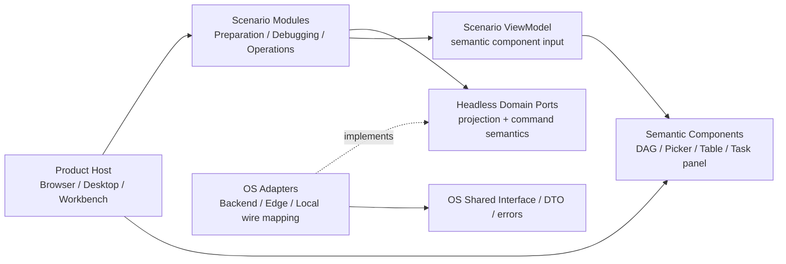
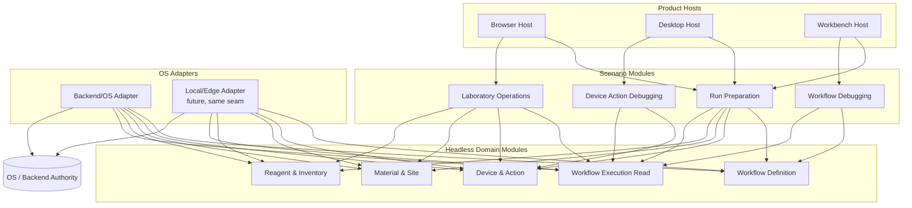

# Uni-Lab FE Module Map v0.1

状态：2026-09-25，正式技术设计第一阶段；core 内 Phase 0-3 完成，Device & Action、Material & Site、Reagent & Inventory 与 Workflow Execution Read 的只读/command seam 已进入，Phase 4/5 延后，Phase 6 仅保留 assembly seam

本文只冻结 FE 的模块层次、处置矩阵、依赖方向和第一阶段实现边界。它不重新定义
OS 权威、Task/NodeJob/Attempt/DeviceCommand、Run Preparation 的领域语义、
ActionResourceContract、Claim/Settlement、`unknown`、通用替代策略、真实设备动作
验证或完整 Event Bus。

## 0. 阶段确认与第一条决策

当前主线已经完成总体架构、领域模型、Run Preparation 语义、最小 OS 垂直切片验证和
workspace 前置盘点；前置验证已关闭，正式产品实现尚未开始。

本轮第一条决策是：**先冻结四层 Module Map 与现有 app/package 的处置，不以旧 package
名称直接推导目标架构；只有这两项稳定后，才冻结 Domain Port、Scenario ViewModel、
semantic component 和 Host 装配。**

本轮不重新讨论：OS/Backend 的领域事实权威、六个能力组的总体语义、
Task/NodeJob/Attempt/DeviceCommand、Run Preparation、ActionResourceContract、
Claim/Settlement、`unknown`、通用 `SubstitutionPolicy`、真实设备动作验证和完整
Event Bus。这些结论沿用前置验证收口文档。

## 1. 四层结构

### 1.1 Product Host

Product Host 是 Browser、Desktop、Workbench 的产品装配层，负责进程/窗口生命周期、
导航、工作区与文件系统接入、权限呈现、宿主布局和能力开关。Host 可以选择 Scenario、
注入 Adapter、挂载 semantic component，但不拥有 Workflow、Device、Material、Site、
Inventory、Task、Job、Claim 或 Settlement 的事实。

三个 Host 的差异只在装配环境：

| Host | 负责 | 不负责 |
| --- | --- | --- |
| Browser | Web 入口、路由、会话、能力呈现 | OS wire DTO、领域状态机 |
| Desktop | Electron 窗口、升级、文件/本地进程桥接 | Workflow/Task/Device 事实 |
| Workbench | Theia、Workspace、编辑器、面板、插件宿主 | 调度、资源规则、运行时安全判断 |

### 1.2 Scenario Modules

Scenario 是面向用户任务的编排模块，组合 Domain Port，持有场景草稿和选择，并输出
Scenario ViewModel。v0.1 只承认以下场景名：

- **Run Preparation**：Published Revision → Run Configuration/Binding Draft → Preflight → SubmitRun。
- **Workflow Debugging**：定义级和运行级观察的组合入口；第一阶段只接 Run Preparation 的入口。
- **Device Action Debugging**：复用标准 WorkflowTask/NodeJob 运行模型的设备动作场景，第一阶段不实现。
- **Laboratory Operations**：运行关注、资源冲突和待处理事项的组合入口，第一阶段不实现。
- **Workflow Authoring**：定义 Draft/Revision/Publication 的产品场景，列入后续，不把旧 editor 整体当作领域模块。

Scenario 可以保存 Run Configuration、Binding Draft、选中项和页面上下文；这些是
Scenario/UI State，不是 OS 事实。Scenario 不拼 URL、不读取 React Query cache 作为
权威、不创建 Reservation/Claim/Task/DeviceCommand、不复制准入或结算规则。

### 1.3 Headless Domain Modules

Headless Domain Module 是无 React、Theia、Electron 依赖的语义模块。OS/Backend 仍是
事实和不变量的权威；FE module 只拥有投影类型、端口语义、错误/能力表达和跨场景可复用
的映射，不拥有第二份事实。

v0.1 的逻辑模块如下，**不是要求立即建立六个 package**：

| 逻辑模块 | FE 拥有的语义 | 第一阶段 |
| --- | --- | --- |
| Workflow Definition | Published Revision、graph、inventory requirement、workflow type、ActionDefinition 投影 | 已进入（Published Revision/Graph 读取） |
| Device & Action | Device/Action 只读投影、能力和资源合同引用、Action Run 的 OS command/read seam | 已进入（目录、定义、提交身份与标准 Task/NodeJob 读取） |
| Material & Site | Material、Site、Site Occupancy 的只读投影 | 已进入（列表、Graph、详情与 Site 读取） |
| Reagent & Inventory | Reagent、Lot、数量库存的只读投影 | 已进入（Backend Reagent 与 Edge Inventory 读取） |
| Workflow Execution Read | SubmitRun 结果、Task/Job/NodeJob Detail、Job Feedback 的读取语义 | 已进入（Task/Jobs/NodeJob/Feedback 只读） |
| Evidence & Intervention | 证据、干预、恢复和对账的场景读取/命令语义 | 部分进入（Intervention 只读） |

这些模块之间不互相复制事实。Run Preparation 是跨模块 Scenario；它可以同时调用
Definition、Device & Action、Material & Site、Reagent & Inventory 和 Execution Read，
但不成为这些模块的事实拥有者。

Device & Action 在 `packages/core/src/domain/device-action/` 内部保持一个连续的
domain 边界：`model.ts` 定义设备、动作和 Action Run 投影，`port.ts` 定义读取与命令端口，
`api.ts`/`codec.ts` 负责 OS DTO 收敛，`client.ts` 只负责把端口接到通用
`RequestTransport`。设备目录和 ActionDefinition 是读取投影；`createActionRun` 只返回 OS
接受的 Task/NodeJob 身份，`getActionRun` 复用 Workflow Execution Read 的标准 Task/Job
投影，不在 Device & Action 内再造任务状态模型。

Material & Site 已沿同一 Domain seam 进入：`GET /materials`、`GET /materials/graph`、
`GET /materials/{id}`、`GET /materials/{id}/sites` 和 `GET /sites/{id}` 只读映射为
Material、Site、Site Occupancy、相对位置和资源模板摘要。缺失的 occupancy 字段保留为
`known: false`；Graph 中跨 Material 节点的 Site 所有者关系必须通过 codec 校验。该 Domain
不提供移动、摆放、删除或库存结算命令。

Reagent & Inventory 已沿同一 Domain seam 进入：Backend 的 `GET /reagent-infos`、
`GET /reagents` 与详情读取，以及 Edge 的 `GET /inventory/instances`、
`GET /inventory/lots`、`GET /inventory/snapshot`。codec 保留缺失的数量、预留和快照维度为
`null` 或空集合，不把未知伪造成零；Lot 的 `empty`、`reserved`、`quarantined` 只由已观测
字段推导。该 Domain 只读，不提供库存写入、Reservation、Claim 或 Settlement。

Evidence & Intervention 当前只进入 Intervention read seam：`GET /workflow-interventions`
与 `GET /workflow-interventions/{id}` 映射待处理事项、候选选项、revision、投递状态和关联
Task/NodeJob。由于 OS 尚未提供独立稳定的 Evidence read contract，本轮不虚构 Evidence
模型，也不提供 intervention decision、resolve-uncertain、恢复或结算命令。

### 1.4 OS Adapters

OS Adapter 是唯一允许接触 Backend/Edge/Local wire DTO、HTTP 路径、响应包络、错误码、
能力发现和传输重试的位置。Adapter 实现 Domain Port，把 OS 的权威事实映射成 FE 投影，
并保留 `execution_unknown`、stale、blocked、confirmation_required 等语义。

v0.1 只需要一个真实 Backend/OS adapter seam。Backend 与 Edge 使用 Shared Interface 时，
可以在同一 seam 下增加实现；在第二个真实实现出现前，不建立可插拔工厂或通用 transport
层。现有 `osRunPreparationAdapter.ts` 和 `taskRuntimeReadDomain.ts` 是验证产物，作为
提取输入和合同测试来源，不直接冻结为最终 package/API。

## 2. Workspace 盘点与处置矩阵

Git 跟踪基线是 4 个 app、24 个 package。磁盘上另有未跟踪的 `packages/design-v2`，
它不计入本基线；`apps/cloud-web` 与 `packages/panel-runtime` 只有 README、没有
`package.json`，不属于 workspace。

处置含义：

- **retain**：保留为目标结构的宿主、基础设施或测试支撑；不等于拥有领域事实。
- **extract**：保留有价值的实现，提取出 headless/domain、Scenario 或 semantic seam；原包不整体迁移。
- **compatibility**：仅作为旧协议/扩展/宿主的过渡适配，禁止进入新 Domain Interface。
- **freeze**：保留现状以支持既有 caller，不扩展能力、不反向定义语义。
- **delete**：无 workspace caller 或仅为残留；本轮只定为删除候选，不直接删除文件。
- **defer**：有真实用途但不在第一阶段，等明确 caller 和 seam 后再进入。

### 2.1 Apps

| App | 当前事实 | 处置 | 目标职责 |
| --- | --- | --- | --- |
| `apps/kernel-web` | 汇聚 services、material、workflow-editor、device-management、Pascal 和布局 | compatibility | 历史 Web/renderer 参考与兼容入口；停止作为新能力默认入口 |
| `apps/desktop` | Electron wrapper，仍预构建 device-card host/agent | retain | Desktop Host；只负责窗口、打包和宿主桥接 |
| `apps/workbench` | Theia browser/desktop 应用，负责工作台生命周期 | retain | Workbench Host；Scenario 由外部装配 |
| `apps/vscode-extension` | Workflow/Material source navigation 的 VS Code adapter | defer | 可选 IDE Host adapter；不进入第一阶段产品核心 |

### 2.2 Packages（24 个基线包）

| Package | 当前主要内容 | 处置 | 迁移/禁止事项 |
| --- | --- | --- | --- |
| `app-shell` | React 壳、可调整分栏 | retain | 仅 Host/UI 基础设施，不放领域事实 |
| `code-editor` | CodeMirror 编辑器 | retain | 仅编辑器基础设施 |
| `design-system` | Radix/Tailwind 设计组件 | retain | 只提供通用 UI，不导出 Domain Port |
| `device-card-agent-cli` | Device Card agent CLI | compatibility | 旧扩展运行兼容；不定义 Device/Action 语义 |
| `device-card-authoring-kit` | Device Card authoring 状态/合同 | freeze | 扩展机制冻结，不能反向修改核心领域 |
| `device-card-builder` | Vue/React card 构建与打包 | freeze | 不进入第一阶段构建链 |
| `device-card-host` | Card runtime host/authoring automation | compatibility | 保持旧 Desktop caller；仅实现扩展 seam |
| `device-card-sdk` | card manifest/bridge/state contract | compatibility | 历史扩展协议；新 Domain Interface 不依赖它 |
| `device-card-tooling` | card CLI/template tooling | freeze | 仅旧扩展维护 |
| `device-card-ui` | card UI elements/registration | freeze | 仅旧扩展维护 |
| `device-management` | Device catalog、action availability、panel、single action UI | extract | 提取 Device & Action read projection 与 Device Action Debugging scenario；UI 不拥有 Task/Job |
| `device-provisioning` | 设备安装/配置入口 | defer | 作为宿主/运维场景保留 caller 证据后再设计 |
| `local-environment` | 本地环境检测与进程能力 | retain | Desktop/Workbench Host adapter，不拥有 Backend Authority |
| `material` | Material domain、store、2D/2.5D UI、undo | extract | 提取 Material & Site read projection；store/viewport 留在 scenario/UI |
| `pascal-host` | Pascal 3D host/editor/viewer | freeze | 只作可选 3D 扩展，不拥有第二份 Material Graph |
| `pascal-lab-plugin` | 3D lab scene、Material scene bridge | freeze | 只消费 Material projection，冻结扩展 seam |
| `robot-workstation` | 实验室运营页面、设备/试剂展示 | extract | 提取 Laboratory Operations semantic projection；不提升为领域权威 |
| `services` | Profile、HTTP、capability、Workflow/Task/Device/Material/Inventory/Realtime、legacy | extract | 按 seam 收深为 Adapter/Port 实现；停止继续扩张为 Kernel |
| `testing` | services fixture/test helper | retain | 测试基础设施；fixture 必须显式标记，不伪造生产事实 |
| `workbench-layout` | panel registry/layout/drag/drop | retain | Workbench Host 基础设施，不依赖 Domain |
| `workbench-session` | 本地环境、workspace/sidecar/session 生命周期 | retain | Workbench Host adapter，不承载 Task/Device 状态 |
| `workbench-theia` | Theia extension，汇聚当前 UI 与 services | retain | Theia Host adapter；逐步改为装配 Scenario/semantic component |
| `workflow-editor` | Authoring、DAG、Run Preparation、trace/runtime UI | extract | 分出 Authoring、Run Preparation、Runtime read scenario；不整体迁移 |
| `workflow-ide-bridge` | source-map/package-source bridge | defer | 仅 IDE/Workbench adapter；不定义 Workflow domain |

额外残留：`apps/cloud-web`、`packages/panel-runtime` 只有 README 且没有 workspace
manifest，删除测试为“删除后无 caller、复杂度不扩散”，因此列为 **delete candidate**；
不为它们补实现。未跟踪的 `packages/design-v2` 列为 **defer/freeze candidate**，在
没有明确 Host caller 前不得加入目标设计。

## 3. 领域事实、Scenario、Host/UI 与兼容层

| 类别 | 事实/职责 | 典型模块 |
| --- | --- | --- |
| 领域事实来源 | Workflow、Revision、Device、Action、Material、Site、Inventory、Task、Job、Claim、Settlement | OS/Backend/Edge |
| FE Domain projection | 只读事实投影、端口语义、错误/能力映射，不拥有 OS 写入事实 | Workflow Definition、Device & Action、Material & Site、Reagent & Inventory、Execution Read |
| Scenario | 场景草稿、选择、编排、ViewModel | Run Preparation、Workflow Debugging、Device Action Debugging、Laboratory Operations |
| UI/宿主基础设施 | 导航、布局、编辑器、窗口、Theia、Electron、React 组件 | app-shell、design-system、code-editor、workbench-*、apps/* |
| 历史兼容/扩展 | 旧协议、旧 Runtime、Device Card、Pascal、IDE bridge | kernel-web、device-card-*、pascal-*、workflow-ide-bridge |

FE Domain module 的“拥有”只指拥有可复用的投影/端口语义；它不改变 OS 的 Authority。
任何需要创建 Task、Claim、DeviceCommand、Reservation 或 Settlement 的动作都必须经过
OS Adapter 的 Command port，由 OS 再次准入并返回结果。

## 4. 依赖方向与禁止依赖

### 4.1 目标方向



代码依赖规则是：Host 可以装配 Scenario、UI 和 Adapter；Scenario 只能依赖 Domain Port
和纯语义工具；semantic component 只依赖 ViewModel/intent props；Domain 不依赖 React、
Theia、Electron、Host 或旧扩展；Adapter 依赖 wire DTO 和 Domain Port；Compatibility
只能被 Host/Adapter 显式包住，不能被新 Domain Port 反向依赖。

### 4.2 必须禁止的边

1. Host → OS URL/DTO、Host → Task/Claim/DeviceCommand 事实。
2. Scenario → `fetch`、URL 拼接、Backend/Edge fallback、资源等价/结算规则。
3. semantic component → Domain Port、React Query cache 作为权威、Task 状态机。
4. Domain module → React/Theia/Electron、`device-card-sdk`、Pascal 或旧 `kernel-web`。
5. Adapter → Scenario/UI；Adapter 不能把 wire DTO 泄漏到 ViewModel。
6. Extension → Device/Action/Execution 语义；核心领域不能反向依赖扩展 manifest。
7. Compatibility → 新 Domain Interface；退役 `/debug/*`、旧 Runtime transport 和 Cloud DTO 不能成为新端口事实来源。
8. `services` → 继续汇聚所有领域和 UI；迁移期间只能按明确 seam 被调用，不能增加新的总入口。

### 4.3 当前 workspace 的结构债务

当前 manifest 依赖显示了几条必须在提取时收窄的边：

```text
kernel-web       → services / workflow-editor / device-management / material / Pascal / layout
workbench-theia  → services / workflow-editor / device-management / material / robot-workstation / Pascal
workflow-editor  → services / material / app-shell / code-editor
device-management→ services / design-system
services         → material / device-card-sdk
pascal-lab-plugin→ material / pascal-host
```

这些边说明旧 packages 不是目标层次：`kernel-web` 和 `workbench-theia` 是汇聚宿主，
`workflow-editor`、`device-management`、`material` 把 UI 与语义混在一起，`services` 同时
承载 wire、projection、query、mutation 和兼容协议。迁移动作是沿 seam 提取并逐步反转
依赖，而不是新增一个包把旧汇聚关系原样复制。目标状态是：Domain projection 不再依赖
`material` 的 React store、`device-card-sdk` 或任何 Host；Scenario 由 Host 装配，Adapter
成为唯一 wire 入口。

## 5. Host / Scenario / Domain / Adapter 装配



Browser、Desktop、Workbench 装配同一组 Domain projection 和 Scenario 端口；差异只在
Host adapter（路由、Electron、Theia、文件/本地环境）。同一 Scenario 不应复制成
`DesktopRunPreparation`、`BrowserRunPreparation` 两套领域逻辑。

## 6. Domain Port 与 Scenario ViewModel 的冻结顺序

1. **Module Map / 处置矩阵**：确认每个 caller 属于 Host、Scenario、Domain projection、Adapter 或 compatibility。
2. **事实与生命周期标签**：给每个输入/输出标记 Server Fact、Command、Draft、Projection、Session/UI State。
3. **Domain Port 语义**：先冻结端口归属、输入输出语义、Authority、权限、能力、版本、错误、幂等和 unknown/stale 处理；不冻结 REST/SSE/RPC 或目录名。
4. **OS Adapter contract tests**：用真实 Published Revision → Preflight → SubmitRun → NodeJob Detail 合同验证 wire 映射；旧 provisional adapter 只作为迁移输入。
5. **Scenario ViewModel**：在端口稳定后组合 `RunPreparationViewModel` 等场景投影；ViewModel 可以跨 Domain，但不升级为事实。
6. **Semantic component**：只接受 ViewModel 和 intent callback，先做最小 Picker/Table/Preflight 状态等语义交互。
7. **Host assembly**：最后把 Browser/Desktop/Workbench 的路由、布局、会话和 adapter 注入组合起来。

因此，本轮不写正式 TypeScript API，也不先实现页面。冻结顺序的停止条件是：端口语义
能被至少一个真实 OS adapter 和一个 Scenario caller 共同验证；没有第二个真实 adapter
时不增加抽象工厂。

## 7. 第一阶段正式实现范围

第一阶段只做一条可审计的 headless + scenario 垂直切片：

1. 从 `services` 提取 Workflow Definition、Device/Action、Material/Site、Reagent/Inventory 的只读投影 seam。
2. 稳定 Run Preparation 场景状态：Run Configuration、Binding Draft、Preflight report 和 `UNMAPPED_RESOURCE_SELECTION` 等明确错误。
3. 接通一个 Backend/OS Adapter：Published Revision/graph、ActionResourceContract 引用、分散资源查询、POST Preflight、SubmitRun 和 NodeJob Detail。
4. 保留 OS 返回的 workflow type、priority/description/metadata、stale/blocked/deferred/confirmation_required 和 `execution_unknown` 语义。
5. 以 adapter contract tests 和 Scenario projection tests 验证依赖方向；Query Cache 只作为接口缓存，不建立全局 FE Domain Store。
6. 为 Browser/Desktop/Workbench 只提供装配 seam 和最小入口，不做三套页面实现。

## 8. 明确不做清单

- 不先创建六个完整领域 package，也不按旧 package 名称机械搬迁。
- 不把 `services` 扩张成总 Kernel，不把 provisional adapter 继续堆成万能 Runtime Port。
- 不创建全局 FE Domain Store，不让 React Query 拥有 Scenario 草稿或 Task 状态机。
- 不实现完整 Workflow Editor、Timeline、Trace 聚合、SSE/WebSocket、Event Bus 或 Task 控制命令。
- 不实现真实设备动作验证、Claim/Settlement 本地规则、通用替代策略或 FE 侧资源等价推导。
- 不让 Host、Scenario、UI、Extension 拥有 OS 领域事实。
- 不让旧 `/debug/*`、旧 Runtime transport、Cloud DTO、Device Card 或 Pascal 反向定义新 Domain Interface。
- 不为 `apps/cloud-web`、`packages/panel-runtime` 或未跟踪 `design-v2` 补功能；没有 caller 前按残留/延期处理。

## 9. 结构审查结论

按 deletion test，`cloud-web`/`panel-runtime` 删除后没有调用者，复杂度不会重新出现；
`device-card-*`、Pascal 和 IDE bridge 的复杂度只在扩展/宿主 caller 存在时才需要，故
冻结或延期。`services`、`material`、`workflow-editor` 和 `device-management` 具有真实
业务价值，但当前接口几乎暴露了实现的混合职责，深度不足；正确动作是沿 Domain/Scenario/
Adapter seam 提取，而不是整体重命名或新增一层转发。

Module Map v0.1 的稳定标志是：删除任一 UI/Host 包不会删除领域事实；删除任一 Scenario
只会删除一个用户任务组合；替换 OS Adapter 不需要改 Scenario ViewModel；Compatibility
包被删除时新 Domain Port 仍可独立编译和验证。

## 10. 目录组织方案

当前阶段不修改既有 `apps/*`，也不移动或重命名既有 `packages/*`。目标结构先落在一个
新的 FE 产品 package 内；四层是这个 package 的内部层次，不是四组横向 package。

```text
packages/
  core/                         # package name: @unilab-fe/core
    src/
      transport/                # generic request contract only
        request.ts              # method/url/headers/body/signal contract

      adapters/                 # concrete transport implementations only
        fetch.ts
        xhr.ts
        electron-ipc.ts         # added only when a real desktop path exists

      domain/
        workflow-definition/
          model.ts              # Published Revision / graph projections
          port.ts               # semantic domain port
          api.ts                # OS routes + request/response DTO shapes
          codec.ts              # DTO ↔ domain projection
          client.ts             # calls injected generic transport
          errors.ts
        workflow-execution-read/
          model.ts              # Task / Job / NodeJob / Feedback read projections
          port.ts
          api.ts
          codec.ts
          client.ts
          errors.ts
        device-action/
          model.ts              # Device / ActionDefinition / Action Run projections
          port.ts                # catalog, definition, command and standard read seams
          api.ts                 # devices, templates and action-run DTO shapes
          codec.ts               # OS DTO ↔ Device & Action projection
          client.ts              # injected transport + Execution Read composition
          errors.ts
        material-site/
          model.ts              # Material / Site / Occupancy projections
          port.ts                # graph, detail and Site read ports
          api.ts                 # material and Site DTO shapes
          codec.ts              # OS DTO ↔ Material & Site projection
          client.ts
          errors.ts
        reagent-inventory/
          model.ts              # Reagent / ReagentInfo / Lot / Instance / Snapshot projections
          port.ts                # Backend Reagent 与 Edge Inventory read ports
          api.ts                 # Reagent 与 inventory DTO shapes
          codec.ts               # Backend/Edge DTO ↔ inventory projection
          client.ts              # injected transport + explicit read routes
          errors.ts
        evidence-intervention/
          model.ts              # Intervention read projection; Evidence remains deferred
          port.ts                # read-only intervention port
          api.ts                 # intervention DTO shape
          codec.ts               # OS DTO ↔ intervention projection
          client.ts              # injected transport + explicit read routes
          errors.ts

      shared/                   # reusable UI-facing building blocks
        components/              # deferred until UI interaction contract is stable
        hooks/                   # deferred until UI interaction contract is stable

      scenarios/                # user-task composition
        run-preparation/
          state.ts
          queries.ts
          commands.ts
          view-model.ts
          store.ts                 # Zustand scenario store
        workflow-debugging/
        device-action-debugging/
        laboratory-operations/

      assembly/                 # dependency wiring only
        backend.ts
```

这里不再按 `adapters/os/workflow-definition`、`adapters/os/run-preparation` 拆目录。
`adapters` 只有技术传输实现；领域接口、OS API 合同和转换逻辑与对应 Domain 同目录，
但它们仍然分成不同文件，避免把外部 DTO 当成领域事实。

依赖方向为：

```text
domain client / scenario
  → generic transport contract
  → concrete adapter
  → fetch / XHR / Electron IPC
```

更准确地说：

- `domain/model.ts`：FE 语义投影和生命周期类型；
- `domain/port.ts`：Scenario 使用的语义接口；
- `domain/api.ts`：外部 OS API 的 route、request、response 合同；
- `domain/codec.ts`：OS DTO 与 FE projection 的转换；
- `domain/client.ts`：使用注入的通用 transport 发起该 Domain 的请求；
- `transport/request.ts`：只定义通用请求执行能力，不知道 Workflow、Task 或 Device；
- `adapters/*`：实现 transport，不知道具体 Domain；
- `assembly`：把 `fetch`、XHR 或 Electron IPC 实现注入 Domain client。

接口合同和转换逻辑属于 Domain 的集成部分，但它们不是 OS 领域事实；OS 路由变化只应
影响对应 Domain 的 `api.ts`/`codec.ts`，不应影响 Scenario 或通用 transport。

## 11. 接口调用方案

以 `Workflow Definition` 为例：

```text
Scenario
  → WorkflowDefinitionPort
  → WorkflowDefinitionClient
  → RequestTransport
  → FetchTransport / ElectronTransport
  → Backend / OS
```

`WorkflowDefinitionClient` 负责：

- 选择 Published Workflow 的 route；
- 构造 request DTO；
- 调用注入的 `RequestTransport`；
- 用 codec 将 response DTO 转成 Published Revision / Graph projection；
- 将 HTTP/OS 错误转换为 Domain 可理解的错误。

它不负责：

- Run Configuration 或 Binding Draft；
- Preflight 决策；
- UI 状态；
- 选择 `fetch` 还是 Electron IPC。

`RequestTransport` 只需要表达通用请求能力：URL、method、headers、body、AbortSignal、
超时和原始响应。它不包含 `getPublishedRevision()` 之类的领域方法。

这样可以替换：

```text
FetchTransport       # Browser / ordinary desktop HTTP
XhrTransport         # only if an existing host requires it
ElectronIpcTransport # only if a real desktop boundary requires it
```

而不改变 `WorkflowDefinitionClient`、Domain Port 或 Scenario。

第一阶段仍不新增 axios；优先使用平台 `fetch`。如果 Desktop 的真实边界不是 HTTP，
只新增一个实现同一 `RequestTransport` 的 Electron adapter，不在 Domain 中加入桌面判断。

Query Cache 放在 Scenario integration 层；Domain client 不拥有缓存、全局 Store 或页面状态。
Command 的幂等、错误、`stale`、`confirmation_required` 和 `execution_unknown` 仍按 OS
合同映射，不能由 transport 层自行解释。

### 11.1 Zustand 结合方式

Zustand 属于 Scenario/UI integration，不进入 Domain。`run-preparation/store.ts` 保存当前
场景的 draft、ViewModel、preflight、submit 结果和 loading/error 状态，并通过
`RunPreparationScenario` 调用 Domain Port；它不直接调用 transport。

同一个 `StateCreator` 提供两个出口：`@unilab-fe/core` 导出
`createRunPreparationStore()` 返回 vanilla `StoreApi`，`@unilab-fe/core/react` 导出
`createRunPreparationReactStore()` 返回 React bound store。两者不是全局单例，而是由每个
Host/route 按场景实例化；React 依赖只通过子路径加载，不污染 vanilla/Desktop 使用方。

Store 中的 Domain projection 只是当前场景快照，OS 仍是事实来源。用户修改
`RunConfiguration` 或 `BindingDraft` 时清空旧 preflight，下一次命令从 Store 读取最新 draft；
不建立全局 FE Domain Store。

## 12. 单个 Domain 示例：Workflow Definition

第一阶段以 `Workflow Definition` 为例。它只表达 Published Revision 和定义侧投影，
不把 Draft、Run Configuration、Task Snapshot 或 OS Workflow 类复制成一个万能 `Workflow`。

```text
core/src/
  domain/
    workflow-definition/
      model.ts                # Published Revision / Workflow Graph
      port.ts                 # Scenario-facing semantic port
      api.ts                  # OS route + request/response DTO contract
      codec.ts                # OS DTO → FE projection
      client.ts               # uses injected RequestTransport
      errors.ts               # semantic error mapping
```

它的 Domain 集成职责是：

- 定义 Published Revision、graph、node template、edge 和 inventory requirement 的 FE 投影；
- 描述 OS API 的 route、request、response 结构；
- 将 OS DTO 转成 FE projection；
- 暴露 Scenario 使用的语义 Port。

它不负责：

- 实现 `fetch`、XHR 或 Electron IPC；
- 编辑 Draft；
- 维护 Run Configuration 或 Binding Draft；
- 决定设备、Material、Site 或 Inventory 是否可用；
- 计算 Preflight、Claim、Settlement 或执行权限。

因此，`adapters` 是公共技术层；`domain/workflow-definition` 才是具体接口、结构和
转换逻辑所在的位置。暂时不预先建立 `entities/`、`repositories/`、`use-cases/`、
`stores/` 等 DDD 目录。

## 13. 具体实现计划

### Phase 0：冻结边界

- 新增一个目标 package，目录为 `packages/core`，包名为 `@unilab-fe/core`；不修改现有 app/package。
- 建立 `domain`、`shared`、`scenarios`、`transport`、`adapters`、`assembly` 的目录规则。
- 暂不接入 Browser、Desktop 或 Workbench。
- 暂不导出正式公共 API。

当前结果：`packages/core` 可以独立 typecheck，且没有对旧 `services`、`kernel-web` 或
Device Card 产生反向依赖。`index.ts` 只导出当前纵向切片，尚未作为全仓稳定公共 API 冻结。

### Phase 1：Workflow Definition Domain

先实现 Published Revision、Workflow Graph、Node Template 引用和
`inventory_requirements` 的 model、port、api、codec、client，并使用 fake transport
完成纯逻辑测试。

当前结果：Scenario 可以替换 fake Port 或 fake Transport，而不修改 Domain 语义文件；已覆盖
Published Workflow 类型校验、列表包络、重复身份、summary/graph identity 与 revision 漂移校验，
并通过 route 编码测试。

### Phase 2：Generic Transport 与具体 Adapter

实现最小 `RequestTransport` 和一个 `FetchTransport`。加入 profile/base URL、AbortSignal、
超时、JSON 解码和基础错误转换。只有真实 Desktop 边界出现后，才加入 Electron IPC 实现。

当前结果：`FetchTransport` 已实现并通过注入式测试；替换 transport 不需要修改 Domain API、
codec 或 Scenario。

### Phase 3：Run Preparation Scenario

实现 Run Configuration、Binding Draft、Preflight、SubmitRun、NodeJob Detail 和
`RunPreparationViewModel`。Scenario 只调用 Domain Port/client，不直接使用 transport。

当前结果：已实现 Run Configuration、Binding Draft、Preflight、SubmitRun、NodeJob Detail
和 `RunPreparationViewModel`，并通过 fake Port/transport 测试验证调用方向与
`UNMAPPED_RESOURCE_SELECTION`。更完整的 stale/confirmation/execution_unknown 场景合同测试
留到接入真实 OS response fixture 时补齐。

同时已加入 `Workflow Execution Read` 的只读链路：`GET /workflow-tasks`、
`GET /workflow-task-presentations`、`GET /workflow-tasks/{id}`、
`GET /workflow-tasks/{id}/jobs`、`GET /workflow-node-jobs/{id}` 和
`GET /workflow-node-jobs/{id}/feedback`。其中 `workflow-task-presentations` 直接映射 OS
提供的紧凑 Task/Job matrix projection，不由 FE 拼装 TaskRuntimeSummary；Task 列表支持
workflow/execution/status/cleanup 筛选，保留未知 status、`execution_unknown` 和
`uncertainty_reason`；Feedback 的 Backend 页码在 Domain client 内收敛为 sequence cursor。
不实现事件、控制命令、Attempt 状态机或前端运行时状态机。

当前 Domain 继续开发已加入 `Device & Action`：设备目录 `GET /devices`、ActionDefinition
列表/详情、`ActionResourceContract` 引用，以及 `POST /device-action-runs` 的 OS command
边界。命令只返回 OS 接受的 Task/NodeJob 身份；运行读取复用标准 Task/NodeJob port，不在
Device & Action 内复制任务状态机，也不把响应解释为真实设备动作已完成。

### Phase 4：最小 Shared UI

只实现该 Scenario 需要的 Picker、RequirementRow、BindingSelection、PreflightStatus
和 SubmitRunResult。组件只消费 ViewModel 和 intent callback。

当前决定：延后实现并回退临时组件。页面交互需求、视觉层级和 Design System 装配尚未讨论
清楚，本阶段不冻结 semantic component props，也不在 `core` 中建立 UI 组件目录。

### Phase 5：Assembly 与受控联调

通过 `assembly/backend.ts` 注入 FetchTransport 和 Domain clients，用一个已发布
`experiment_operation` 完成 Published Revision → Preflight → SubmitRun → NodeJob Detail。
不执行真实设备动作。

当前决定：延后并回退 `experiment_operation` fixture 和合同测试。它们只服务于临时联调，
尚未形成稳定的真实 OS contract；后续应在明确真实 OS caller 和 response fixture 位置后，
重新建立测试资产，不进入正式 Domain API。

### Phase 6：Host 接入评估

Phase 5 通过后，才评估 Browser、Desktop、Workbench 的装配方式。三者复用 Domain client、
Scenario 和 ViewModel，只替换 transport/profile 和 Host 能力。

当前结果：已加入 `assembly/host.ts`。Browser、Desktop、Workbench 通过同一个
`createProductHostAssembly()` 注入 `RequestTransport`，复用同一组 Domain client、Scenario
和 ViewModel；差异只保留在 Host descriptor 的 profile/capabilities。现有三个 app 尚未改动，
Electron IPC 和真实 Workbench transport 等待真实 caller 出现后再实现。
